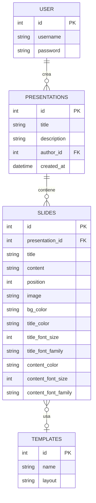
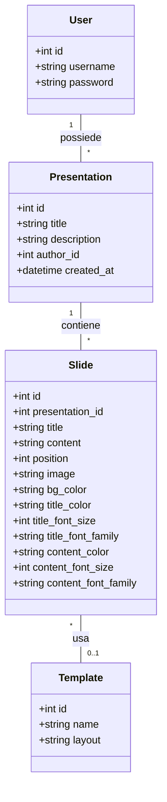
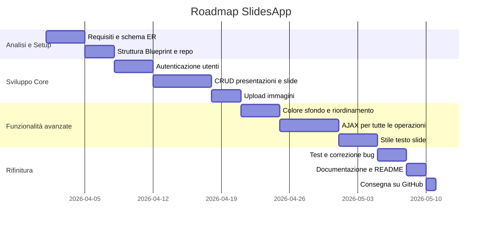

# Documento dei Requisiti – SlidesApp

> Questo documento descrive i requisiti per il progetto **SlidesApp**, un'applicazione web per la creazione e la gestione di presentazioni digitali, sviluppata con Python/Flask e SQLite.

---

## 1. Introduzione

### 1.1 Scopo del documento

Lo scopo di questo documento è:

- descrivere in modo chiaro il prodotto **SlidesApp** e le sue funzionalità principali;
- raccogliere i requisiti funzionali e non funzionali che guidano lo sviluppo;
- fornire una progettazione concettuale con diagrammi ER, UML e casi d'uso;
- definire una roadmap con le attività principali per la consegna del progetto.

### 1.2 Contesto

SlidesApp è un progetto didattico sviluppato nell'ambito del corso di Sviluppo Web e Database del quinto anno. L'applicazione consente di creare, gestire e visualizzare presentazioni composte da slide, in modo simile a strumenti come PowerPoint o Google Slides, ma semplificato e interamente basato su template predefiniti. Le scelte tecniche adottate sono:

- **Backend**: Python 3 + Flask;
- **Persistenza**: database relazionale SQLite (file nella cartella `instance/`);
- **Architettura**: separazione delle responsabilità tramite **Blueprints** per le route e **pattern Repository** per l'accesso ai dati;
- **Rendering iniziale**: template Jinja2 lato server;
- **Interazioni dinamiche**: AJAX con `fetch()` per le operazioni CRUD, evitando il ricaricamento completo della pagina;
- **Autenticazione**: sessioni Flask con password hashate tramite Werkzeug.

### 1.3 Tema

Tema scelto: **SlidesApp**.

SlidesApp permette all'utente autenticato di creare presentazioni e popolarne le slide con titolo, testo, immagine e stile personalizzato (colore di sfondo, colore del testo, dimensione e font). Le slide sono ordinate e riorganizzabili. Il sistema è progettato per essere semplice, modulare e facilmente estendibile.

---

## 2. Obiettivi generali

- Permettere a un utente di registrarsi, autenticarsi e gestire presentazioni personali.
- Consentire la creazione, modifica, eliminazione e riordinamento delle slide all'interno di una presentazione.
- Supportare la personalizzazione visiva delle slide: colore di sfondo, colore/dimensione/font del titolo e del contenuto.
- Gestire l'upload di immagini da associare alle slide.
- Offrire interazioni fluide tramite AJAX, senza ricaricare l'intera pagina ad ogni operazione.
- Strutturare il codice in modo modulare e manutenibile (Blueprints + Repository).

---

## 3. Stakeholder e attori

| Stakeholder | Ruolo | Interesse |
| --- | --- | --- |
| Studente sviluppatore | Autore del progetto | Realizzare l'app rispettando requisiti tecnici e funzionali |
| Docente | Valutatore | Verificare correttezza tecnica, qualità del codice e completezza |
| Utente finale | Fruitore dell'app | Creare e gestire le proprie presentazioni in modo semplice |

### Attori principali

- `Utente autenticato`: può creare e gestire presentazioni e slide proprie.
- `Visitatore`: utente non autenticato; può accedere solo alle pagine pubbliche (login/registrazione).

---

## 4. Requisiti funzionali

### 4.1 Requisiti principali

1. Registrazione e login con credenziali (username e password hashata).
2. Creazione di presentazioni con titolo e descrizione.
3. Visualizzazione dell'elenco delle presentazioni dell'utente autenticato.
4. Aggiunta di slide a una presentazione con titolo, testo, immagine opzionale e colore di sfondo.
5. Modifica di una slide esistente: titolo, testo, immagine, colore di sfondo, stile del testo (colore, dimensione, font) per titolo e contenuto.
6. Eliminazione di singole slide.
7. Riordinamento delle slide (sposta su / sposta giù).
8. Eliminazione di una presentazione con rimozione automatica di tutte le slide collegate (cascade delete).
9. Anteprima live della slide durante la modifica, aggiornata via AJAX senza ricaricare la pagina.
10. Aggiornamento del colore di sfondo a tutte le slide di una presentazione in un'unica operazione.
11. Tutte le operazioni CRUD effettuate tramite endpoint JSON (`/api/...`) e aggiornamento del DOM via JavaScript, senza navigazione tra pagine.

### 4.2 User stories

- Come **utente**, voglio registrarmi e accedere, così le mie presentazioni sono associate al mio account e private.
- Come **utente autenticato**, voglio creare una nuova presentazione con titolo e descrizione per organizzare le mie slide.
- Come **utente autenticato**, voglio aggiungere slide a una presentazione specificando titolo, testo, immagine e colore di sfondo.
- Come **utente autenticato**, voglio modificare lo stile di una slide (font, dimensione, colori) e vedere un'anteprima in tempo reale.
- Come **utente autenticato**, voglio spostare le slide su e giù per cambiare l'ordine della presentazione.
- Come **utente autenticato**, voglio eliminare slide o intere presentazioni senza dover ricaricare la pagina.
- Come **utente autenticato**, voglio cambiare il colore di sfondo a tutte le slide in un clic.

---

## 5. Requisiti non funzionali

- **Usabilità**: l'interfaccia deve essere intuitiva; le operazioni principali devono avvenire senza cambi di pagina grazie ad AJAX.
- **Sicurezza**: le password devono essere memorizzate hashate (Werkzeug `generate_password_hash`); i file caricati devono essere validati e i nomi normalizzati con `secure_filename`; le route protette richiedono autenticazione tramite il decoratore `@login_required`.
- **Persistenza**: i dati sono memorizzati su SQLite nella cartella `instance/`; il database è inizializzato tramite `setup_db.py`.
- **Manutenibilità**: il codice è suddiviso in Blueprints (`presentations`, `slides`, `api`, `auth`) e Repository (`presentation_repository`, `slide_repository`, `user_repository`, `template_repository`).
- **Portabilità**: l'app deve poter essere eseguita localmente con Python 3.x e un ambiente virtuale; la configurazione è minimale e documentata nel `README.md`.
- **Robustezza**: l'app gestisce errori comuni (form non validi, file mancanti, ID inesistenti) restituendo messaggi chiari all'utente tramite flash messages o risposte JSON con campo `error`.
- **Limiti upload**: i file immagine accettati devono essere limitati per tipo (JPEG/PNG) e dimensione (max 5 MB).
- **Documentazione**: il `README.md` deve includere istruzioni per installazione, esecuzione e struttura del progetto; il codice deve avere commenti nei punti non ovvi.

---

## 6. Glossario dei termini

- `Presentazione`: raccolta ordinata di slide; ha attributi `id`, `title`, `description`, `author_id`, `created_at`.
- `Slide`: elemento di una presentazione con `id`, `presentation_id`, `title`, `content`, `position`, `image`, `bg_color`, attributi di stile del testo (`title_color`, `title_font_size`, `title_font_family`, `content_color`, `content_font_size`, `content_font_family`).
- `Template`: modello di layout per le slide (tabella `templates` con `name` e `layout`); attualmente predefinito lato server.
- `Repository`: componente software che incapsula l'accesso al database (es. `slide_repository.py`).
- `Blueprint`: modulo Flask che raggruppa route correlate; i blueprint del progetto sono `presentations`, `slides`, `api`, `auth`.
- `Utente`: account registrato con `id`, `username`, `password` (hashata).
- `AJAX`: tecnica che usa `fetch()` in JavaScript per comunicare con gli endpoint `/api/` e aggiornare il DOM senza ricaricare la pagina.
- `Cascade delete`: eliminazione automatica delle slide associate quando si elimina una presentazione (definita nello schema SQL con `ON DELETE CASCADE`).

---

## 7. Entità e relazioni (schema ER)

Schema basato su `app/schema.sql` con le estensioni pianificate per lo stile del testo.

La relazione `USER` → `PRESENTATIONS` è uno-a-molti: ogni presentazione appartiene a un utente. La relazione `PRESENTATIONS` → `SLIDES` è uno-a-molti con cascade delete: eliminare una presentazione rimuove tutte le sue slide.

---

## 8. Diagramma UML delle classi

Diagramma che rappresenta le classi di dominio, i repository e i principali servizi.

---

## 9. Casi d'uso

### 9.1 Casi d'uso principali

1. Registrazione utente
2. Login
3. Logout
4. Creare presentazione
5. Visualizzare elenco presentazioni
6. Aprire dettaglio presentazione
7. Aggiungere slide
8. Modificare slide (testo, immagine, stile)
9. Riordinare slide (sposta su / sposta giù)
10. Eliminare slide
11. Eliminare presentazione
12. Cambiare colore di sfondo a tutte le slide

### 9.2 Descrizione semplificata dei casi d'uso

- **Registrazione**: il visitatore inserisce username e password; il sistema salva l'account con password hashata e reindirizza al login.
- **Login**: l'utente inserisce le credenziali; il sistema verifica l'hash e apre la sessione. Tutte le route protette richiedono sessione attiva.
- **Creare presentazione**: l'utente autenticato inserisce titolo e descrizione; la presentazione viene creata e associata al suo account.
- **Aggiungere slide**: dall'interno di una presentazione, l'utente compila il form (titolo, testo, colore sfondo, immagine opzionale); la slide viene aggiunta in coda tramite una chiamata AJAX senza ricaricare la pagina.
- **Modificare slide**: l'utente apre la pagina di modifica della slide, cambia i campi desiderati (inclusi colori e font), vede un'anteprima in tempo reale aggiornata via AJAX, e salva.
- **Riordinare slide**: l'utente clicca "Sposta su" o "Sposta giù"; una chiamata AJAX aggiorna le posizioni nel DB e ridisegna l'elenco delle slide nel DOM.
- **Eliminare slide / presentazione**: l'utente clicca il bottone di eliminazione; una chiamata AJAX rimuove l'elemento e lo fa sparire dal DOM con un'animazione.
- **Cambiare colore a tutte le slide**: l'utente sceglie un colore dal form nel dettaglio presentazione; una chiamata AJAX aggiorna tutti i record e aggiorna visivamente le slide mostrate.

---

## 10. Pianificazione e milestone

| Settimana | Attività |
| --- | --- |
| 1 | Analisi requisiti, setup ambiente, schema DB, struttura Blueprints e repository |
| 2 | CRUD presentazioni e slide, upload immagini, autenticazione base |
| 3 | Riordinamento slide, colore di sfondo, refactoring (spostamento route in blueprint slides) |
| 4 | AJAX per tutte le operazioni CRUD, anteprima live nella pagina di modifica slide |
| 5 | Stile testo per slide (colore, font, dimensione), test, documentazione, consegna GitHub |

### 10.1 Gantt semplificato

---

## 11. Suggerimenti per la consegna

- Includere un `README.md` con istruzioni chiare per: creazione dell'ambiente virtuale (`python -m venv venv`), installazione dipendenze (`pip install flask`), inizializzazione del DB (`python setup_db.py`) e avvio dell'app (`python run.py`).
- Aggiungere un file `requirements.txt` con almeno `Flask` e `Werkzeug`.
- Usare un `.gitignore` che escluda `__pycache__/`, `.venv/`, `instance/` e i file temporanei di upload.
- Includere screenshot delle pagine principali nella cartella `docs/screenshots/` (lista presentazioni, dettaglio con slide, pagina di modifica slide con anteprima).
- Allegare i diagrammi (ER, UML, Gantt) nella cartella `docs/diagrams/` come immagini PNG o sorgenti Mermaid.
- Fare commit piccoli e descrittivi lungo tutto lo sviluppo; evitare un unico commit finale con tutto il codice.
- Verificare che la cartella `instance/` e la cartella `static/uploads/` siano escluse dal repository ma create automaticamente all'avvio (il codice già usa `os.makedirs(..., exist_ok=True)`).
