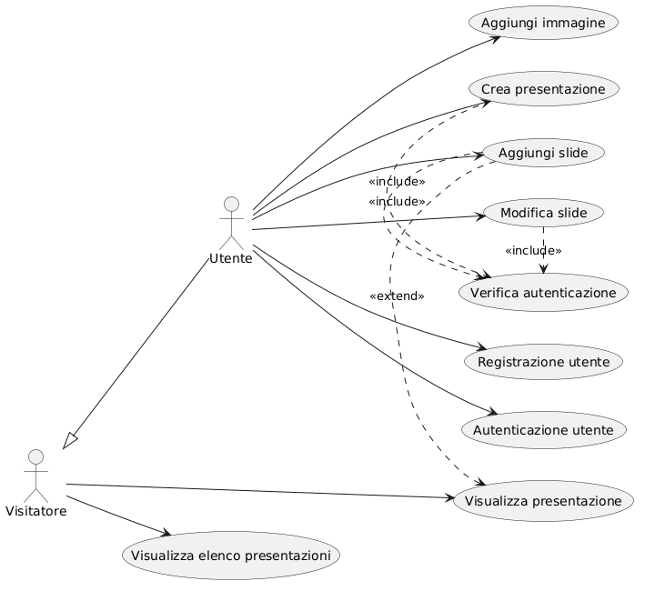
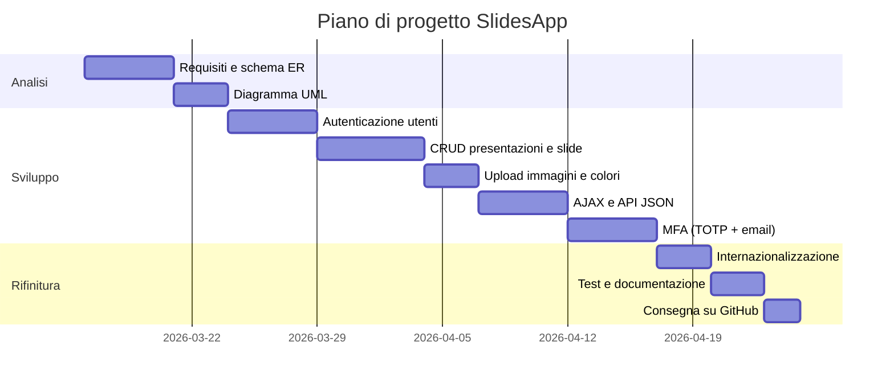
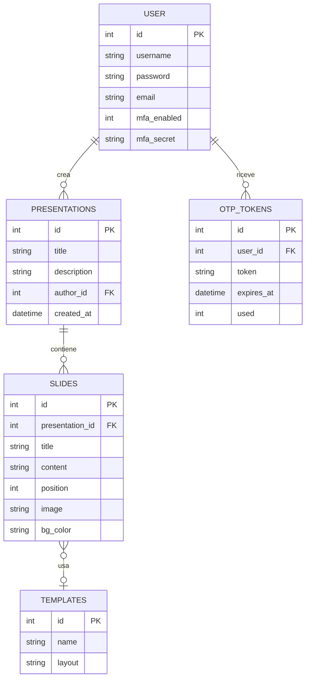
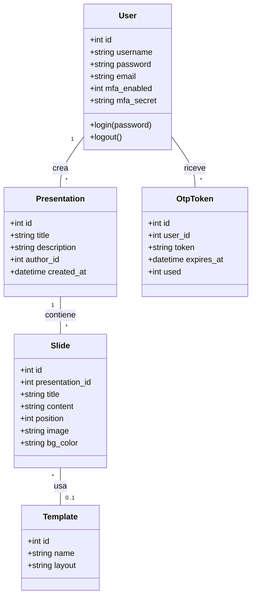

# Documento dei Requisiti – SlidesApp

> Questo documento descrive i requisiti per il progetto **SlidesApp**, un'applicazione web per la creazione e la gestione di presentazioni digitali.

---

## 1. Introduzione

### 1.1 Scopo del documento

Lo scopo di questo documento è:

- descrivere in modo chiaro il prodotto **SlidesApp** e le sue funzionalità principali;
- raccogliere i requisiti funzionali e non funzionali che guidano lo sviluppo;
- fornire una prima progettazione concettuale e una roadmap di lavoro con diagrammi ER, UML e casi d'uso, organizzata nelle fasi di analisi, sviluppo e rifinitura;
- definire una roadmap di lavoro con milestone e attività principali.

### 1.2 Contesto

Il progetto è sviluppato nell'ambito del corso di Sviluppo Web e Database del quinto anno. L'applicazione è un sistema per la creazione e gestione di presentazioni digitali composte da slide. Le scelte tecniche adottate prevedono:

- una gestione dati persistente tramite database relazionale (SQLite);
- una parte di autenticazione e sicurezza con password hashate e Multi-Factor Authentication (MFA);
- un'interfaccia web con visualizzazione dinamica tramite AJAX e template Jinja2;
- relazioni tra più tabelle nel database (utenti, presentazioni, slide, template).

### 1.3 Tema

Tema scelto: **SlidesApp**.

SlidesApp è uno strumento web per creare, gestire e visualizzare presentazioni digitali composte da slide. Ogni slide contiene un titolo, un testo, un colore di sfondo personalizzabile e un'immagine opzionale. Le slide sono ordinate all'interno di ogni presentazione e possono essere riorganizzate. Il sistema supporta più lingue (italiano, inglese, spagnolo) tramite Flask-Babel e offre interazioni dinamiche senza ricaricamento della pagina grazie ad AJAX.

---

## 2. Obiettivi generali

- Permettere a un utente di registrarsi e autenticarsi in modo sicuro, con possibilità di attivare l'autenticazione a due fattori (MFA).
- Consentire la creazione, modifica, eliminazione e visualizzazione delle presentazioni personali.
- Consentire l'aggiunta, la modifica, l'eliminazione e il riordinamento delle slide all'interno di una presentazione.
- Permettere la personalizzazione visiva delle slide: colore di sfondo e upload di immagini.
- Offrire interazioni fluide tramite AJAX, senza ricaricare l'intera pagina ad ogni operazione.
- Supportare più lingue dell'interfaccia (italiano, inglese, spagnolo) con un selettore sempre visibile nella barra di navigazione.

---

## 3. Stakeholder e attori

| Stakeholder | Ruolo | Interesse |
| --- | --- | --- |
| Studente sviluppatore | Autore del progetto | Realizzare il progetto rispettando i requisiti tecnici e funzionali |
| Docente | Valutatore | Verificare correttezza tecnica, qualità del codice e completezza |
| Utente finale | Fruitore dell'app | Creare e gestire le proprie presentazioni in modo semplice |

### Attori principali

- `Utente autenticato`: può creare e gestire presentazioni e slide proprie, e configurare la sicurezza del proprio account.
- `Visitatore`: utente non autenticato; può accedere solo alle pagine di login e registrazione.

---

## 4. Requisiti funzionali

### 4.1 Requisiti principali

1. Registrazione e login con username e password hashata (Werkzeug).
2. Attivazione opzionale dell'autenticazione a due fattori (MFA): tramite app TOTP con QR code (Google Authenticator, Authy) oppure tramite codice OTP inviato via email.
3. Creazione di presentazioni con titolo e descrizione.
4. Visualizzazione dell'elenco delle presentazioni dell'utente autenticato.
5. Aggiunta di slide a una presentazione con titolo, testo, colore di sfondo e immagine opzionale.
6. Modifica di una slide esistente: titolo, testo, immagine e colore di sfondo.
7. Eliminazione di singole slide.
8. Riordinamento delle slide all'interno di una presentazione (sposta su / sposta giù).
9. Eliminazione di una presentazione con rimozione automatica di tutte le slide collegate (cascade delete).
10. Aggiornamento del colore di sfondo a tutte le slide di una presentazione in un'unica operazione.
11. Tutte le operazioni CRUD avvengono tramite endpoint JSON (`/api/...`) e aggiornamento del DOM via JavaScript, senza navigazione tra pagine.
12. Interfaccia disponibile in tre lingue (italiano, inglese, spagnolo) con selettore a bandiera sempre visibile nella topbar.

### 4.2 User stories

- Come **utente**, voglio registrarmi e accedere così che le mie presentazioni siano associate al mio account e private.
- Come **utente autenticato**, voglio attivare la verifica in due passaggi con il mio telefono o la mia email per proteggere meglio il mio account.
- Come **utente autenticato**, voglio creare una nuova presentazione con titolo e descrizione per organizzare le mie slide.
- Come **utente autenticato**, voglio aggiungere slide a una presentazione specificando titolo, testo, colore di sfondo e immagine opzionale.
- Come **utente autenticato**, voglio modificare una slide esistente e vedere le modifiche aggiornate subito.
- Come **utente autenticato**, voglio spostare le slide su e giù per cambiare l'ordine della presentazione senza ricaricare la pagina.
- Come **utente autenticato**, voglio eliminare slide o intere presentazioni con un semplice clic.
- Come **utente**, voglio cambiare la lingua dell'interfaccia (italiano, inglese, spagnolo) in qualsiasi momento tramite il menu a bandiere in alto a destra.

---

## 5. Requisiti non funzionali

- **Usabilità**: l'interfaccia deve essere intuitiva; le operazioni principali devono avvenire senza cambi di pagina grazie ad AJAX; i messaggi di feedback (successo in verde, errore in rosso) devono comparire e scomparire automaticamente con animazione.
- **Sicurezza**: le password devono essere memorizzate hashate tramite Werkzeug; i file caricati devono essere validati e i nomi normalizzati con `secure_filename`; le route protette richiedono autenticazione tramite il decoratore `@login_required`; il secondo fattore MFA deve essere verificato prima di completare il login.
- **Persistenza**: i dati sono memorizzati su SQLite nella cartella `instance/`; il database viene inizializzato tramite `setup_db.py`.
- **Manutenibilità**: il codice è suddiviso in Blueprint (`presentations`, `slides`, `api`, `auth`) e Repository (`presentation_repository`, `slide_repository`, `user_repository`, `template_repository`).
- **Portabilità**: l'app deve poter essere eseguita localmente con Python 3.x e un ambiente virtuale; la configurazione è minimale e documentata nel `README.md`.
- **Internazionalizzazione**: tutte le stringhe visibili all'utente sono avvolte con `_()` di Flask-Babel; le traduzioni sono compilate in file `.mo` a partire dai file `.po`.
- **Robustezza**: l'app gestisce errori comuni (form non validi, file mancanti, ID inesistenti) restituendo messaggi chiari tramite flash messages categorizzati (`success` / `error`) o risposte JSON.
- **Documentazione**: il `README.md` include istruzioni per installazione, esecuzione e compilazione delle traduzioni; il codice ha commenti nei punti non ovvi.

---

## 6. Casi d'uso

### 6.1 Casi d'uso principali

1. Registrazione utente
2. Login
3. Verifica MFA (secondo fattore)
4. Configurazione MFA (TOTP o email)
6. Creare presentazione
7. Visualizzare elenco presentazioni
8. Aprire dettaglio presentazione
9. Aggiungere slide
10. Modificare slide
11. Riordinare slide (sposta su / sposta giù)
12. Eliminare slide
13. Eliminare presentazione
14. Cambiare colore di sfondo a tutte le slide
15. Cambiare lingua interfaccia

### 6.2 Descrizione semplificata dei casi d'uso

- **Registrazione**: il visitatore inserisce username e password; il sistema salva l'account con password hashata e reindirizza al login.
- **Login**: l'utente inserisce le credenziali; il sistema verifica l'hash della password. Se l'utente ha MFA attivo, viene reindirizzato alla verifica del secondo fattore prima di accedere.
- **Verifica MFA**: l'utente inserisce il codice a 6 cifre generato dall'app authenticator (TOTP) oppure ricevuto via email (OTP); solo dopo la verifica la sessione viene aperta.
- **Configurazione MFA**: l'utente autenticato sceglie il metodo (QR code o email), segue le istruzioni guidate e conferma con un codice valido per attivare il secondo fattore.
- **Creare presentazione**: l'utente compila il form con titolo e descrizione; la presentazione viene creata tramite AJAX e appare nella lista senza ricaricare la pagina.
- **Aggiungere slide**: dall'interno di una presentazione, l'utente compila il form con titolo, testo, colore di sfondo e immagine opzionale; la slide viene aggiunta in coda tramite AJAX.
- **Modificare slide**: l'utente apre la pagina di modifica, cambia i campi desiderati e salva; le modifiche vengono inviate tramite AJAX.
- **Riordinare slide**: l'utente clicca "Sposta su" o "Sposta giù"; una chiamata AJAX aggiorna le posizioni nel DB e ridisegna l'elenco delle slide nel DOM.
- **Eliminare slide / presentazione**: l'utente clicca il bottone di eliminazione; una chiamata AJAX rimuove l'elemento e lo fa sparire dal DOM con animazione.
- **Cambiare lingua**: l'utente clicca la bandiera desiderata nel menu a tendina in alto a destra; la lingua viene salvata in sessione e applicata a tutta l'interfaccia.

### 6.3 Diagramma dei casi d'uso

---

## 7. Glossario dei termini

- `Presentazione`: raccolta ordinata di slide con attributi `id`, `title`, `description`, `author_id`, `created_at`.
- `Slide`: elemento di una presentazione con `id`, `presentation_id`, `title`, `content`, `position`, `image`, `bg_color`.
- `Template`: modello di layout per le slide (tabella `templates` con `name` e `layout`); predefinito lato server.
- `Repository`: componente software che incapsula l'accesso al database (es. `slide_repository.py`).
- `Blueprint`: modulo Flask che raggruppa route correlate; i blueprint del progetto sono `presentations`, `slides`, `api`, `auth`.
- `Utente`: account registrato con `id`, `username`, `password` (hashata), `email` (per MFA email), `mfa_enabled`, `mfa_secret`.
- `MFA`: Multi-Factor Authentication, autenticazione a due fattori. Aggiunge un secondo controllo d'identità oltre alla password.
- `TOTP`: Time-based One-Time Password (standard RFC 6238). Codice a 6 cifre che cambia ogni 30 secondi, generato da un'app come Google Authenticator. Non richiede connessione internet.
- `OTP email`: codice a 6 cifre generato casualmente, salvato nel DB con scadenza di 10 minuti e inviato via email all'utente.
- `AJAX`: tecnica che usa `fetch()` in JavaScript per comunicare con gli endpoint `/api/` e aggiornare il DOM senza ricaricare la pagina.
- `Flask-Babel`: libreria per l'internazionalizzazione; usa il sistema GNU gettext con file `.po` (testo) e `.mo` (compilato binario).
- `Cascade delete`: eliminazione automatica delle slide quando si elimina una presentazione, definita nello schema SQL con `ON DELETE CASCADE`.

---

## 8. Pianificazione e milestone

Questa sezione descrive la sequenza di lavoro del progetto, con tre fasi principali:

- **Analisi**: definire i requisiti, i casi d'uso e i modelli concettuali.
- **Sviluppo**: realizzare le funzionalità principali, l'interfaccia e la gestione dati.
- **Rifinitura**: testare, correggere e preparare la consegna.

Nella fase di analisi si producono gli schemi ER e UML; questi documenti aiutano a progettare il database e le classi prima di scrivere il codice.

| Settimana | Attività |
| --- | --- |
| 1 | Analisi dei requisiti, schema ER e UML, setup ambiente, struttura Blueprint e repository |
| 2 | Autenticazione utenti (registrazione, login, sessioni, `@login_required`) |
| 3 | CRUD presentazioni e slide, upload immagini, riordinamento, colore di sfondo |
| 4 | AJAX per tutte le operazioni CRUD, refactoring blueprint `slides` e blueprint `api` |
| 5 | MFA (TOTP + email OTP), internazionalizzazione (it/en/es), test e consegna |

### 8.1 Gantt semplificato

> Il Gantt è uno strumento utile per pianificare, ma in classe può bastare anche una tabella di milestone.

---

## 9. Entità e relazioni (schema ER)

Schema basato su `app/schema.sql` con le estensioni per MFA pianificate.

---

## 10. Diagramma UML delle classi

Diagramma semplificato che mostra le classi di dominio principali del sistema.

---

