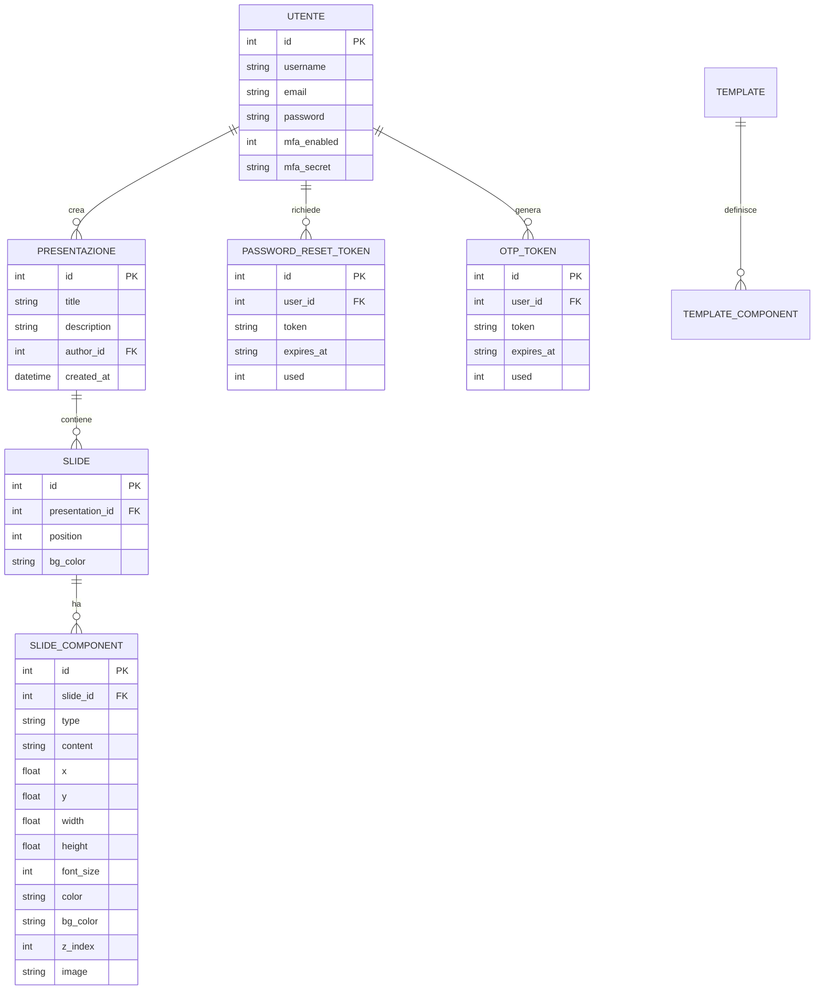
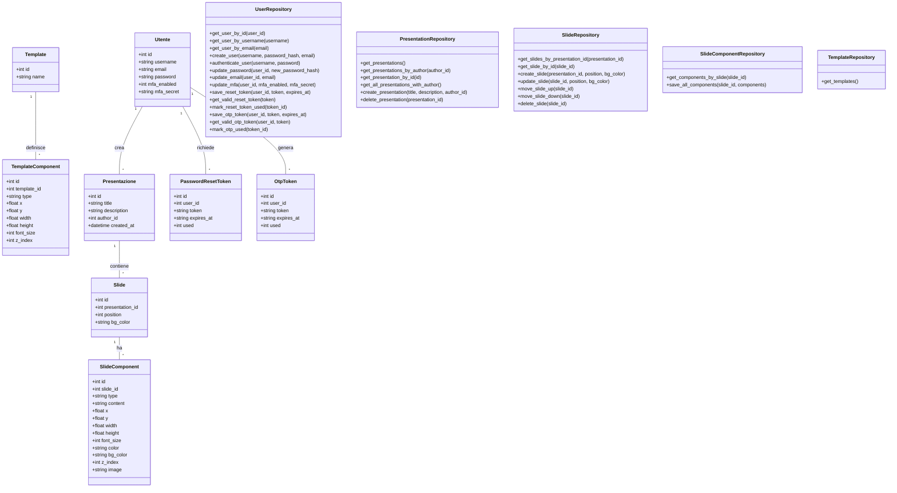
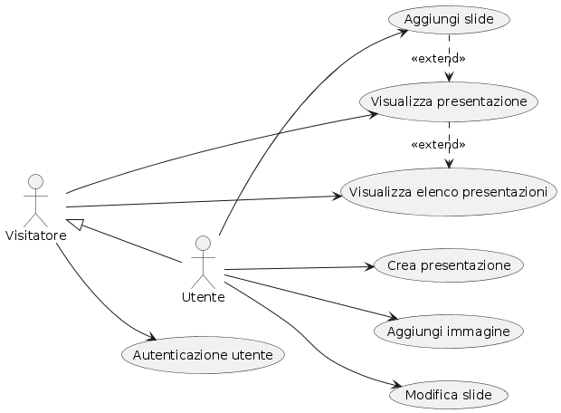
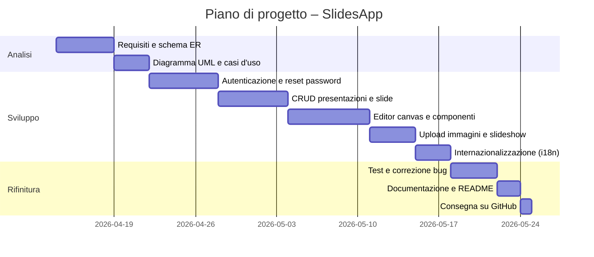

# Documento dei Requisiti – SlidesApp

> Data: 2026-05-12

## 1. Introduzione

### 1.1 Scopo del documento

Lo scopo di questo documento è:
- descrivere in modo chiaro il prodotto da realizzare: **SlidesApp**;
- raccogliere i requisiti funzionali e non funzionali;
- fornire una progettazione concettuale con diagrammi ER, UML e casi d'uso;
- definire una roadmap di lavoro con milestone e attività principali.

### 1.2 Contesto

Il progetto è sviluppato nel contesto del modulo `03_Sviluppo_Web_e_Database` del quinto anno. Il prodotto prevede:
- una gestione dati persistente (presentazioni, slide, componenti);
- un sistema di autenticazione e sicurezza (hashing password, reset via email, sessioni);
- un'interfaccia web con editor canvas interattivo;
- relazioni tra più tabelle nel database.

### 1.3 Tema scelto

Tema scelto: **SlidesApp**.

SlidesApp è un'applicazione web per creare e gestire presentazioni a diapositive. Gli utenti registrati possono creare presentazioni, aggiungere slide e comporre liberamente ogni slide inserendo componenti (titolo, testo, immagini, link) su un canvas posizionabile. Le presentazioni possono essere visualizzate in modalità slideshow a schermo intero.

## 2. Obiettivi generali

- Permettere a un utente di registrarsi, autenticarsi e reimpostare la password via email.
- Consentire la creazione, modifica ed eliminazione di presentazioni.
- Permettere di aggiungere, riordinare ed eliminare slide all'interno di una presentazione.
- Consentire la composizione libera di ogni slide tramite un editor canvas con componenti trascinabili e ridimensionabili.
- Supportare i tipi di componente: titolo, testo, immagine, link.
- Permettere l'upload di immagini da inserire come componenti.
- Offrire una modalità presentazione (slideshow) a schermo intero.
- Supportare l'internazionalizzazione dell'interfaccia (italiano, inglese, spagnolo).

## 3. Stakeholder e attori

| Stakeholder | Ruolo | Interesse |
| --- | --- | --- |
| Studente | Sviluppatore | Realizzare il progetto rispettando i requisiti |
| Docente | Valutatore | Verificare correttezza tecnica e completezza |
| Utente finale | Chiunque voglia creare presentazioni | Usare l'app per creare e visualizzare presentazioni |

### Attori principali

- `Visitatore` – utente non autenticato, può accedere solo a login e registrazione
- `Utente autenticato` – può gestire presentazioni, slide e componenti

## 4. Requisiti funzionali

### 4.1 Requisiti principali

1. Registrazione con username, email e password.
2. Login con username e password (sessione via cookie).
3. Logout.
4. Reset della password tramite link inviato via email.
5. Creazione di una presentazione con titolo e descrizione.
6. Visualizzazione dell'elenco delle proprie presentazioni.
7. Visualizzazione del dettaglio di una presentazione con tutte le sue slide.
8. Eliminazione di una presentazione.
9. Aggiunta di una nuova slide a una presentazione.
10. Riordino delle slide (sposta su / sposta giù).
11. Eliminazione di una slide.
12. Apertura dell'editor canvas per modificare una slide.
13. Aggiunta di componenti sulla slide (titolo, testo, immagine, link).
14. Spostamento e ridimensionamento dei componenti tramite drag & drop.
15. Modifica delle proprietà di un componente (testo, colore, dimensione font).
16. Upload di un'immagine come componente.
17. Modifica del colore di sfondo della slide.
18. Salvataggio dei componenti della slide.
19. Modalità presentazione (slideshow) a schermo intero con navigazione frecce.
20. Cambio lingua dell'interfaccia (italiano, inglese, spagnolo).

### 4.2 User stories

- Come **visitatore**, voglio registrarmi con username, email e password, così da poter creare un account e accedere all'applicazione.
- Come **visitatore**, voglio fare login con le mie credenziali affinché le mie presentazioni siano accessibili sotto il mio account.
- Come **visitatore**, voglio richiedere il reset della password via email in modo da poter recuperare l'accesso al mio account.
- Come **utente autenticato**, voglio creare una nuova presentazione con titolo e descrizione per organizzare il mio contenuto.
- Come **utente autenticato**, voglio aggiungere slide a una presentazione per strutturare il contenuto in diapositive.
- Come **utente autenticato**, voglio aprire l'editor canvas di una slide per posizionare liberamente testi, immagini e link.
- Come **utente autenticato**, voglio trascinare e ridimensionare i componenti sulla slide per ottenere il layout che desidero.
- Come **utente autenticato**, voglio caricare un'immagine come componente per inserire foto e grafica nella presentazione.
- Come **utente autenticato**, voglio riordinare le slide per cambiare la sequenza della presentazione.
- Come **utente autenticato**, voglio avviare la modalità slideshow per presentare le slide a schermo intero.
- Come **utente autenticato**, voglio eliminare presentazioni o slide non più utili per mantenere ordinato il mio spazio.

## 5. Requisiti non funzionali

- L'interfaccia deve essere chiara e utilizzabile anche su schermi di medie dimensioni.
- Le password devono essere salvate con hashing (`werkzeug.security`).
- I token di reset password devono avere scadenza di 1 ora e essere monouso.
- Il backend deve usare un database relazionale SQLite.
- Il codice deve essere organizzato con Blueprint e Repository pattern.
- Il progetto deve essere eseguibile localmente con ambiente virtuale Python.
- I dati devono essere persistenti tra una sessione e l'altra.
- Le route che richiedono autenticazione devono restituire 401 per le richieste API e reindirizzare al login per le richieste web.
- L'editor canvas deve mantenere le proporzioni 16:9 (960×540 px) scalate via CSS transform.
- L'applicazione deve supportare i18n tramite Flask-Babel (it, en, es).

## 6. Glossario dei termini

- `Presentazione`: contenitore principale creato da un utente, composto da un insieme ordinato di slide. Campi nel DB: `title`, `description`, `author_id`, `created_at`.
- `Slide`: singola diapositiva di una presentazione, caratterizzata da `position` e `bg_color`; contiene componenti.
- `Componente`: elemento posizionabile liberamente su una slide. Tipi: `title`, `text`, `image`, `link`.
- `Canvas`: area di editing di 960×540 px (proporzioni 16:9) scalata via CSS transform per adattarsi allo schermo.
- `Template`: layout predefinito ("Vuota", "Titolo + Testo") che precompila una slide con componenti iniziali. Colonna `name` nel DB.
- `Password Reset Token`: token monouso con scadenza 1 ora, salvato nella tabella `password_reset_tokens`, usato per il reset della password via email.
- `OTP Token`: token one-time-password salvato nella tabella `otp_tokens`, usato per autenticazione a due fattori.
- `Utente`: account registrato che può gestire le proprie presentazioni. La password è salvata hashata nel campo `password`.
- `Visitatore`: utente non autenticato che può solo registrarsi o fare login.
- `Slideshow`: modalità di presentazione a schermo intero con navigazione tramite frecce o tasti.

## 7. Entità e relazioni (schema ER)

## 8. Diagramma UML delle classi

## 9. Casi d'uso

### 9.1 Casi d'uso principali

1. `Registrazione utente`
2. `Login`
3. `Logout`
4. `Reset password`
5. `Crea presentazione`
6. `Visualizza elenco presentazioni`
7. `Visualizza dettaglio presentazione`
8. `Elimina presentazione`
9. `Aggiungi slide`
10. `Riordina slide`
11. `Elimina slide`
12. `Modifica slide (editor canvas)`
13. `Aggiungi componente`
14. `Sposta/ridimensiona componente`
15. `Upload immagine`
16. `Avvia slideshow`
17. `Cambia lingua interfaccia`

### 9.2 Descrizione semplificata dei casi d'uso

- **Registrazione utente**: il visitatore inserisce username, email e password; il sistema valida i dati, crea l'account con password hashata e reindirizza al login.
- **Login**: il visitatore inserisce username e password; il sistema verifica le credenziali e apre la sessione.
- **Reset password**: il visitatore inserisce la propria email; il sistema genera un token monouso con scadenza di 1 ora e invia un link via email; l'utente imposta la nuova password.
- **Crea presentazione**: l'utente autenticato compila titolo e descrizione; il sistema salva la presentazione associata al suo account.
- **Aggiungi slide**: l'utente apre il dettaglio di una presentazione e aggiunge una nuova slide; il sistema la inserisce in fondo con sfondo bianco predefinito.
- **Modifica slide (editor canvas)**: l'utente apre l'editor di una slide; può aggiungere componenti tramite dropdown, trascinarli e ridimensionarli sul canvas 960×540; al salvataggio il sistema persiste tutti i componenti.
- **Upload immagine**: durante la modifica di una slide, l'utente seleziona un file immagine; il sistema lo salva in `static/uploads/` e restituisce il path per il componente.
- **Avvia slideshow**: l'utente avvia la modalità presentazione; le slide vengono mostrate a schermo intero con navigazione tramite frecce o tasti.

### 9.3 Diagramma dei casi d'uso

Il diagramma dei casi d'uso è stato generato come immagine a partire dal file PlantUML `diagramma_casi_uso.puml`.

## 10. Pianificazione e milestone

| Settimana | Attività |
| --- | --- |
| 1 | Analisi dei requisiti, scelta del tema, disegno ER e UML, preparazione ambiente di lavoro |
| 2 | Configurazione Flask, sistema di autenticazione (registrazione, login, logout, reset password) |
| 3 | Implementazione CRUD presentazioni e slide, riordino slide |
| 4 | Editor canvas: drag & drop componenti, upload immagine, salvataggio componenti |
| 5 | Modalità slideshow, i18n (it/en/es), testing, documentazione, consegna GitHub |

### 10.1 Gantt semplificato

## 11. Suggerimenti per la consegna

- Caricare il progetto su GitHub con una struttura chiara (`slides-app/`, `instance/` esclusa).
- Tenere un file `README.md` con istruzioni di installazione, creazione dell'ambiente virtuale e avvio del server.
- Usare `.gitignore` per escludere `__pycache__`, `.venv`, `instance/` e `files/`.
- Fare commit frequenti e significativi durante lo sviluppo.
- Includere i diagrammi ER, UML e casi d'uso nel repository o nel documento dei requisiti.
- Configurare le variabili d'ambiente necessarie (chiave segreta Flask, credenziali Flask-Mail) tramite file `.env` (non committato).
