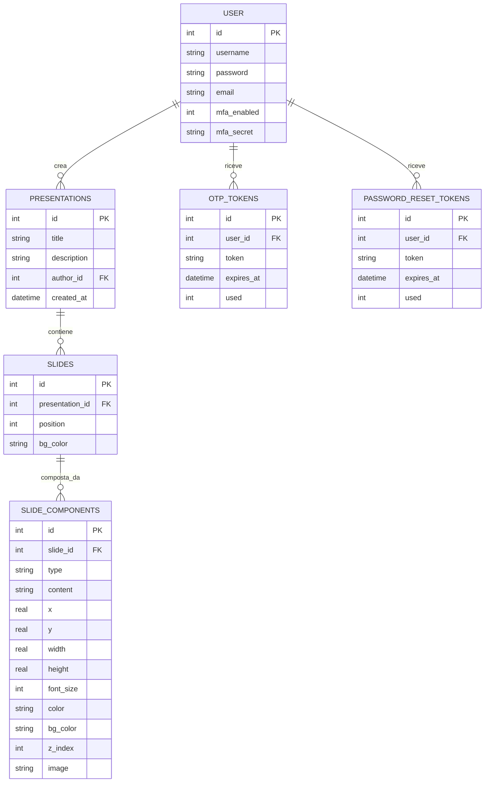
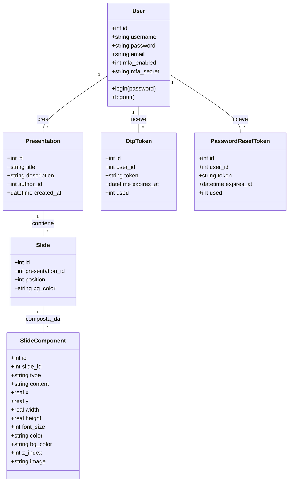
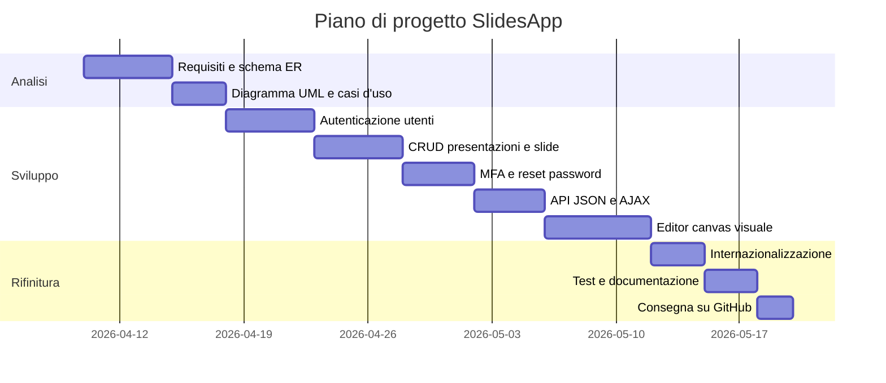

# Documento dei Requisiti – SlidesApp

> Questo documento descrive i requisiti per il progetto **SlidesApp**, un'applicazione web per la creazione e la gestione di presentazioni digitali con editor canvas visuale.

## 1. Introduzione

### 1.1 Scopo del documento

Lo scopo di questo documento è:

- descrivere in modo chiaro il prodotto **SlidesApp** e le sue funzionalità principali;
- raccogliere i requisiti funzionali e non funzionali che guidano lo sviluppo;
- fornire una prima progettazione concettuale e una roadmap di lavoro con diagrammi ER, UML e casi d'uso, organizzata nelle fasi di analisi, sviluppo e rifinitura;
- definire una roadmap di lavoro con milestone e attività principali.

### 1.2 Contesto

Il progetto è sviluppato nell'ambito del corso di Sviluppo Web e Database del quinto anno. L'applicazione è un sistema per la creazione e gestione di presentazioni digitali composte da slide. Le scelte tecniche adottate prevedono:

- una gestione dati persistente tramite database relazionale (SQLite);
- una parte di autenticazione e sicurezza con password hashate, Multi-Factor Authentication (MFA) e reset password via email;
- un'interfaccia web con visualizzazione dinamica tramite AJAX e template Jinja2;
- un editor canvas visuale per il posizionamento libero di componenti sulle slide;
- relazioni tra più tabelle nel database (utenti, presentazioni, slide, componenti slide, token).

### 1.3 Tema

Tema scelto: **SlidesApp**.

SlidesApp è uno strumento web per creare, gestire e visualizzare presentazioni digitali composte da slide. Ogni slide è un canvas visuale su cui l'utente posiziona liberamente componenti di tipo titolo, testo, immagine o link, trascinandoli e ridimensionandoli con il mouse. Le slide sono ordinate all'interno di ogni presentazione e possono essere riorganizzate. Il sistema supporta più lingue (italiano, inglese, spagnolo) tramite Flask-Babel e offre interazioni dinamiche senza ricaricamento della pagina grazie ad AJAX.

## 2. Obiettivi generali

- Permettere a un utente di registrarsi e autenticarsi in modo sicuro, con possibilità di attivare l'autenticazione a due fattori (MFA) e di recuperare la password via email.
- Consentire la creazione, modifica, eliminazione e visualizzazione delle presentazioni personali.
- Consentire l'aggiunta, il riordinamento e l'eliminazione delle slide all'interno di una presentazione.
- Offrire un editor canvas visuale per comporre il contenuto di ogni slide: aggiunta, spostamento, ridimensionamento ed eliminazione di componenti (titolo, testo, immagine, link).
- Permettere la personalizzazione visiva di ogni componente: dimensione testo, colore, sfondo, immagine.
- Offrire interazioni fluide tramite AJAX, senza ricaricare l'intera pagina ad ogni operazione.
- Supportare più lingue dell'interfaccia (italiano, inglese, spagnolo) con un selettore sempre visibile nella barra di navigazione.

## 3. Stakeholder e attori

| Stakeholder | Ruolo | Interesse |
| --- | --- | --- |
| Studente sviluppatore | Autore del progetto | Realizzare il progetto rispettando i requisiti tecnici e funzionali |
| Docente | Valutatore | Verificare correttezza tecnica, qualità del codice e completezza |
| Utente finale | Fruitore dell'app | Creare e gestire le proprie presentazioni in modo semplice |

### Attori principali

- `Visitatore`: utente non autenticato; può accedere alle pagine di login e registrazione.
- `Utente`: account autenticato; specializzazione di Visitatore. Può creare e gestire presentazioni, slide e componenti propri, e configurare la sicurezza del proprio account.

## 4. Requisiti funzionali

### 4.1 Requisiti principali

1. Registrazione e login con username e password hashata (Werkzeug).
2. Attivazione opzionale dell'autenticazione a due fattori (MFA): tramite app TOTP con QR code (Google Authenticator, Authy) oppure tramite codice OTP inviato via email.
3. Reset della password tramite link inviato via email (token monouso con scadenza).
4. Creazione di presentazioni con titolo e descrizione.
5. Visualizzazione dell'elenco delle presentazioni dell'utente autenticato.
6. Aggiunta di slide a una presentazione (canvas vuoto con colore di sfondo).
7. Riordinamento delle slide all'interno di una presentazione (sposta su / sposta giù).
8. Eliminazione di singole slide.
9. Eliminazione di una presentazione con rimozione automatica di tutte le slide e componenti collegati (cascade delete).
10. Editor canvas visuale per ogni slide: aggiunta di componenti di tipo titolo, testo, immagine o link.
11. Spostamento dei componenti sulla slide tramite drag & drop con il mouse.
12. Ridimensionamento dei componenti tramite 8 handle direzionali (nw, n, ne, e, se, s, sw, w).
13. Modifica delle proprietà di ogni componente: contenuto, dimensione testo, colore, colore di sfondo.
14. Upload di immagini per i componenti di tipo immagine.
15. Spostamento fine dei componenti tramite tasti freccia (passo 1%; con Shift passo 5%).
16. Eliminazione del componente selezionato tramite tasto Delete o dal pannello proprietà.
17. Salvataggio dello stato del canvas tramite chiamata AJAX all'API.
18. Interfaccia disponibile in tre lingue (italiano, inglese, spagnolo) con selettore a bandiera sempre visibile nella topbar.

### 4.2 User stories

- Come **utente**, voglio registrarmi e accedere così che le mie presentazioni siano associate al mio account e private.
- Come **utente autenticato**, voglio attivare la verifica in due passaggi con il mio telefono o la mia email per proteggere meglio il mio account.
- Come **utente**, voglio poter recuperare la password via email nel caso in cui la dimentichi.
- Come **utente autenticato**, voglio creare una nuova presentazione con titolo e descrizione per organizzare le mie slide.
- Come **utente autenticato**, voglio aggiungere una slide vuota a una presentazione e personalizzare il colore di sfondo.
- Come **utente autenticato**, voglio aprire l'editor canvas di una slide e aggiungere componenti (titolo, testo, immagine, link) posizionandoli liberamente.
- Come **utente autenticato**, voglio trascinare i componenti sul canvas per cambiarne la posizione senza ricaricare la pagina.
- Come **utente autenticato**, voglio ridimensionare un componente trascinando i suoi handle per adattarlo allo spazio disponibile.
- Come **utente autenticato**, voglio modificare il testo, il colore e la dimensione di un componente dal pannello proprietà laterale.
- Come **utente autenticato**, voglio caricare un'immagine per un componente immagine direttamente nell'editor.
- Come **utente autenticato**, voglio spostare le slide su e giù per cambiare l'ordine della presentazione.
- Come **utente autenticato**, voglio eliminare slide o intere presentazioni con un semplice clic.
- Come **utente**, voglio cambiare la lingua dell'interfaccia (italiano, inglese, spagnolo) in qualsiasi momento tramite il menu a bandiere in alto a destra.

## 5. Requisiti non funzionali

- **Usabilità**: l'interfaccia deve essere intuitiva; le operazioni principali devono avvenire senza cambi di pagina grazie ad AJAX; l'editor canvas deve rispondere in tempo reale al mouse senza ritardi visibili.
- **Sicurezza**: le password devono essere memorizzate hashate tramite Werkzeug; i file caricati devono essere validati e i nomi normalizzati con `secure_filename`; le route protette richiedono autenticazione tramite il decoratore `@login_required`; il secondo fattore MFA deve essere verificato prima di completare il login; i token di reset password devono avere una scadenza e essere monouso.
- **Persistenza**: i dati sono memorizzati su SQLite nella cartella `instance/`; il database viene inizializzato tramite `setup_db.py`.
- **Manutenibilità**: il codice è suddiviso in Blueprint (`presentations`, `slides`, `api`, `auth`) e Repository (`presentation_repository`, `slide_repository`, `slide_component_repository`, `user_repository`).
- **Portabilità**: l'app deve poter essere eseguita localmente con Python 3.x e un ambiente virtuale; la configurazione è minimale e documentata nel `README.md`.
- **Internazionalizzazione**: tutte le stringhe visibili all'utente sono avvolte con `_()` di Flask-Babel.
- **Robustezza**: l'app gestisce errori comuni (form non validi, file mancanti, ID inesistenti) restituendo messaggi chiari tramite flash messages categorizzati (`success` / `error`) o risposte JSON con campo `ok`.
- **Documentazione**: il `README.md` include istruzioni per installazione, esecuzione e compilazione delle traduzioni.

## 6. Glossario dei termini

- `Presentazione`: raccolta ordinata di slide con attributi `id`, `title`, `description`, `author_id`, `created_at`.
- `Slide`: canvas visuale di una presentazione con attributi `id`, `presentation_id`, `position`, `bg_color`. Non contiene testo direttamente: il contenuto è affidato ai componenti.
- `Componente slide`: elemento posizionato su una slide con `id`, `slide_id`, `type`, `content`, `x`, `y`, `width`, `height`, `font_size`, `color`, `bg_color`, `z_index`, `image`. Il tipo può essere `title`, `text`, `image` o `link`.
- `Utente`: account registrato con `id`, `username`, `password` (hashata), `email`, `mfa_enabled`, `mfa_secret`.
- `Visitatore`: persona non autenticata che può accedere alle pagine di login e registrazione.
- `Token OTP`: codice temporaneo inviato via email per la verifica MFA, con scadenza e flag `used`.
- `Token reset password`: link monouso inviato via email per il reset della password, con scadenza e flag `used`.

## 7. Entità e relazioni (schema ER)

Schema basato su `app/schema.sql`.



## 8. Diagramma UML delle classi

Diagramma semplificato che mostra le classi di dominio principali del sistema.



## 9. Casi d'uso

### 9.1 Casi d'uso principali

1. Registrazione utente
2. Login
3. Reset password via email
4. Creare presentazione
5. Aggiungere slide
6. Aprire editor canvas di una slide
7. Aggiungere componente alla slide
8. Salvare il canvas
9. Eliminare presentazione

### 9.2 Descrizione semplificata dei casi d'uso

- **Registrazione**: il visitatore inserisce username, email e password; il sistema salva l'account con password hashata e reindirizza al login.
- **Login**: l'utente inserisce le credenziali; il sistema verifica l'hash della password. Se l'utente ha MFA attivo, viene reindirizzato alla verifica del secondo fattore prima di accedere.
- **Verifica MFA**: l'utente inserisce il codice a 6 cifre generato dall'app authenticator (TOTP) oppure ricevuto via email (OTP); solo dopo la verifica la sessione viene aperta.
- **Reset password**: l'utente inserisce la propria email; il sistema invia un link con token monouso; cliccando il link l'utente imposta una nuova password.
- **Creare presentazione**: l'utente compila il form con titolo e descrizione; la presentazione viene creata tramite AJAX e appare nella lista senza ricaricare la pagina.
- **Aggiungere slide**: dall'interno di una presentazione, l'utente clicca "Aggiungi slide"; il sistema crea una slide vuota con sfondo bianco e la aggiunge in coda tramite AJAX.
- **Riordinare slide**: l'utente clicca "Sposta su" o "Sposta giù"; una chiamata AJAX aggiorna le posizioni nel DB e ridisegna l'elenco delle slide nel DOM.
- **Aprire editor canvas**: l'utente clicca "Modifica" su una slide; viene caricata la pagina dell'editor con il canvas (960×540 px, scalato via CSS transform) e il pannello proprietà laterale.
- **Aggiungere componente**: l'utente apre il menu "+ Aggiungi" e sceglie il tipo (titolo, testo, immagine, link); il componente appare sul canvas con dimensioni e posizione predefinite.
- **Spostare componente**: l'utente clicca e trascina il componente; la posizione viene aggiornata in percentuale in tempo reale senza chiamate al server.
- **Ridimensionare componente**: l'utente trascina uno degli 8 handle colorati attorno al componente selezionato; larghezza e altezza vengono aggiornate in percentuale.
- **Modificare proprietà**: l'utente seleziona un componente; nel pannello laterale modifica testo, dimensione font, colore o sfondo; le modifiche sono visibili immediatamente sul canvas.
- **Salvare il canvas**: l'utente clicca "Salva"; una chiamata AJAX invia tutti i componenti con le loro proprietà all'API, che li salva nel database.
- **Cambiare lingua**: l'utente clicca la bandiera desiderata nel menu a tendina in alto a destra; la lingua viene salvata in sessione e applicata a tutta l'interfaccia.

### 9.3 Relazioni tra casi d'uso: include ed extend

In un diagramma dei casi d'uso si usano due tipi di relazioni aggiuntive:

- `<<include>>`: rappresenta un comportamento obbligatorio e riutilizzabile. Un caso d'uso base include un altro quando quel comportamento viene sempre eseguito.
- `<<extend>>`: rappresenta un comportamento opzionale o condizionale che si aggiunge al caso d'uso base solo in certe situazioni.

I casi d'uso non devono essere confusi con i rapporti tra attori. In SlidesApp, `Utente` è una specializzazione di `Visitatore`: l'utente può fare tutto ciò che può fare un visitatore, più alcune azioni riservate. Questo si modella con una generalizzazione tra attori:

```
   Visitatore
       ^
       |
     Utente
```

Relazioni `<<include>>` — la verifica dell'autenticazione è un passaggio obbligatorio per tutte le azioni che modificano i dati:

- `Crea presentazione` <<include>> `Verifica autenticazione`
- `Aggiungi slide` <<include>> `Verifica autenticazione`
- `Elimina slide` <<include>> `Verifica autenticazione`
- `Elimina presentazione` <<include>> `Verifica autenticazione`
- `Apri editor canvas` <<include>> `Verifica autenticazione`
- `Salva canvas` <<include>> `Verifica autenticazione`

Relazioni `<<extend>>` — comportamenti opzionali che si attivano solo in certe condizioni:

- `Verifica MFA` <<extend>> `Login`: il sistema chiede il codice MFA solo se l'utente lo ha attivato.
- `Reset password` <<extend>> `Login`: l'utente può richiedere il reset password solo dalla pagina di login, quando non ricorda le credenziali.
- `Upload immagine` <<extend>> `Modifica proprietà componente`: il caricamento dell'immagine è disponibile solo quando il componente selezionato è di tipo immagine.

### 9.4 Diagramma dei casi d'uso

Il diagramma dei casi d'uso è stato generato a partire dal file
PlantUML `docs/SlidesApp_UseCase.puml`.


## 10. Pianificazione e milestone

Questa sezione descrive la sequenza di lavoro del progetto, con tre fasi principali:

- **Analisi**: definire i requisiti, i casi d'uso e i modelli concettuali.
- **Sviluppo**: realizzare le funzionalità principali, l'interfaccia e la gestione dati.
- **Rifinitura**: testare, correggere e preparare la consegna.

Nella fase di analisi si producono gli schemi ER e UML; questi documenti aiutano a progettare il database e le classi prima di scrivere il codice.

| Settimana | Attività |
| --- | --- |
| 1 | Analisi dei requisiti, schema ER e UML, setup ambiente, struttura Blueprint e repository |
| 2 | Autenticazione utenti (registrazione, login, sessioni, `@login_required`) |
| 3 | CRUD presentazioni e slide, riordinamento, API JSON, MFA e reset password |
| 4 | Editor canvas visuale: componenti drag & drop, resize, pannello proprietà, salvataggio AJAX |
| 5 | Internazionalizzazione (it/en/es), upload immagini, test e consegna |

### 10.1 Gantt semplificato



## 11. Suggerimenti per la consegna

- Caricare il progetto su GitHub con una struttura chiara.
- Tenere un file `README.md` con istruzioni di installazione e uso:
  creare l'ambiente virtuale (`python -m venv venv`), installare le
  dipendenze (`pip install -r requirements.txt`), inizializzare il
  database (`python setup_db.py`) e avviare l'app (`python run.py`).
- Usare `.gitignore` per escludere `__pycache__`, `.venv`,
  `instance/` e i file `*.mo`.
- Includere i diagrammi di progetto nella cartella `docs/`.
- Fare commit frequenti e significativi.
