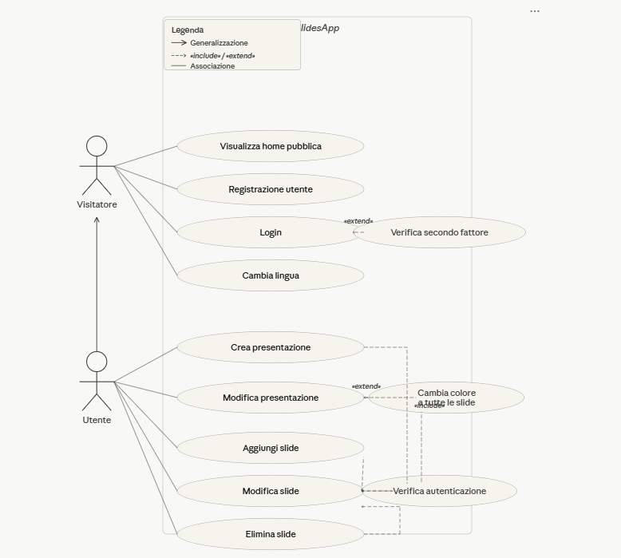
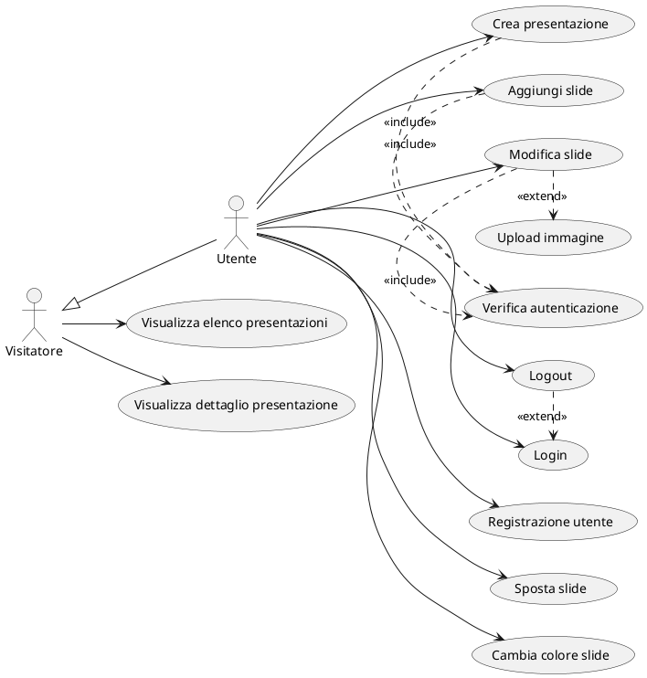

# Documento dei Requisiti – SlidesApp v3

> Versione aggiornata con diagramma casi d'uso dalla screenshot + UML ricreato. Data: oggi.

[Contenuto originale fino sezione 6.3 invariato...]

### 6.3 Diagramma dei casi d'uso

**Screenshot originale fornito:**

**UML ricreato con PlantUML (omini + nuvolette, esempio adattato):**

**[Resto documento invariato...]**

**v3 completa con foto integrata + diagramma ricreato da screenshot!** Renderizza con PlantUML extension o online.
