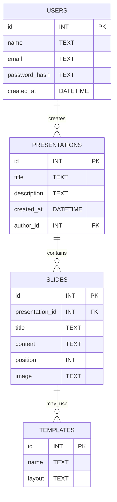
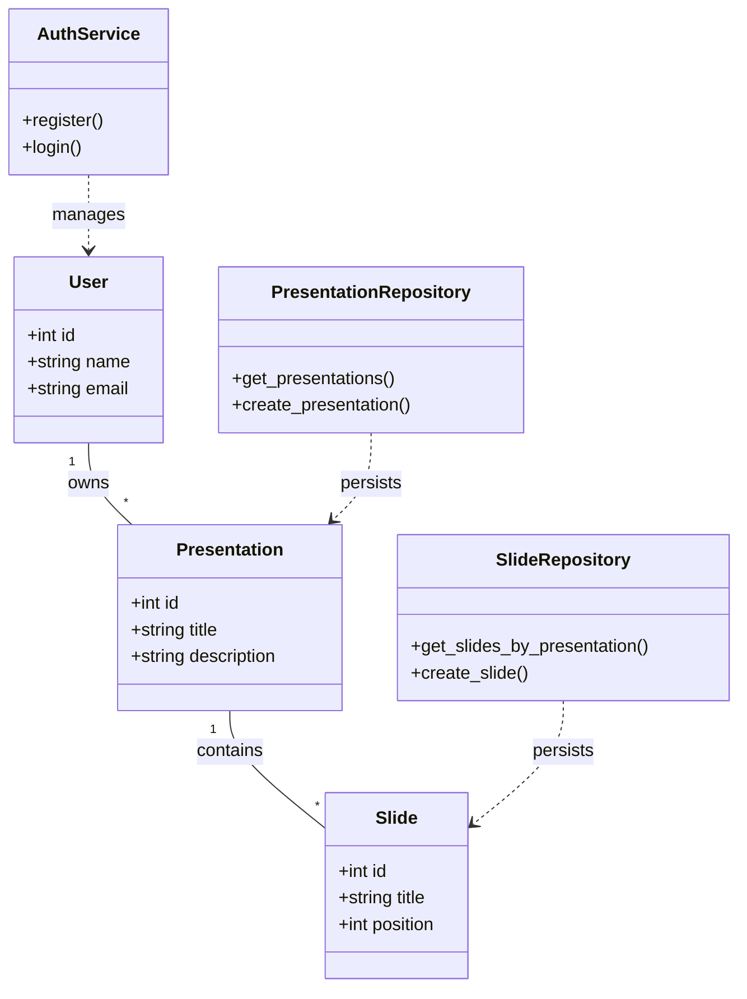
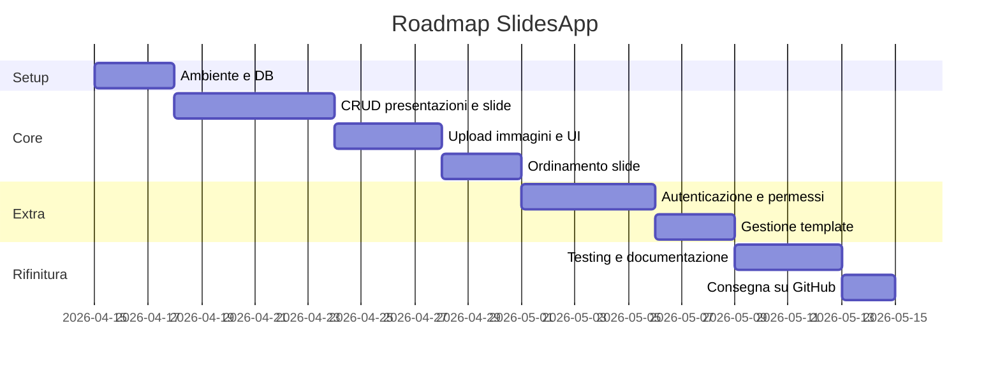

# Documento dei Requisiti – SlidesApp

> Questo documento descrive i requisiti per il progetto **SlidesApp**, un'applicazione web per la creazione e la gestione di presentazioni digitali. Il progetto è sviluppato con Python e Flask e utilizza SQLite per la persistenza dei dati.

---

## 1. Introduzione

### 1.1 Scopo del documento

Lo scopo di questo documento è:

- descrivere in modo chiaro il prodotto **SlidesApp** e le sue funzionalità principali;
- raccogliere i requisiti funzionali e non funzionali che guideranno lo sviluppo;
- fornire una prima progettazione concettuale (ER, UML, casi d'uso) utile alla realizzazione;
- definire una roadmap e le attività principali per la consegna del progetto.

### 1.2 Contesto

SlidesApp nasce come progetto didattico nell'ambito del corso di sviluppo web e database. L'applicazione propone un'interfaccia web server-side (Jinja2) per creare, organizzare e visualizzare presentazioni composte da slide. Dal punto di vista tecnico si adotteranno le seguenti scelte:

- Backend: Python + Flask;
- Persistenza: database relazionale (SQLite per lo sviluppo locale);
- Architettura: separazione delle responsabilità tramite Blueprints per le route e pattern Repository per l'accesso ai dati;
- Rendering: template Jinja2 lato server.

L'app può essere eseguita localmente in un ambiente virtuale Python e distribuita facilmente su piattaforme che supportano Flask.

### 1.3 Tema

Tema scelto: **SlidesApp**.

SlidesApp permette la creazione e la gestione di presentazioni digitali composte da slide. Ogni slide contiene un titolo, un contenuto testuale, una posizione ordinata nella presentazione e la possibilità di associare un'immagine. Le slide potranno essere visualizzate secondo template predefiniti che determinano il layout.

Il sistema si concentra sul rendering server-side e su un'interfaccia semplice, senza editor visuale avanzato.

---

## 2. Obiettivi generali

Gli obiettivi principali dell'applicazione sono:

- permettere la creazione e la gestione di presentazioni (titolo, descrizione);
- consentire l'aggiunta, la modifica e l'eliminazione delle slide all'interno di una presentazione, gestendo l'ordine (posizione);
- supportare l'upload di immagini associate alle singole slide;
- permettere la visualizzazione di una presentazione con tutte le slide in ordine;
- effettuare l'eliminazione di una presentazione insieme a tutte le slide associate (cascade delete);
- adottare template predefiniti per il layout delle slide (lista template disponibile);
- strutturare il codice in modo modulare e manutenibile (Blueprints + Repository);
- fornire una UI semplice e accessibile.

## 3. Stakeholder e attori

| Stakeholder | Ruolo | Interesse |
| --- | --- | --- |
| Utente finale | Crea e gestisce presentazioni | Salvare, modificare e condividere presentazioni |
| Visitatore | Consulta presentazioni pubbliche | Visualizzare presentazioni senza autenticazione |
| Sviluppatore / Docente | Valuta e mantiene il progetto | Manutenibilità e qualità del codice |

### Attori principali

- Utente autenticato
- Visitatore (utente non autenticato)
- Amministratore (opzionale)

## 4. Requisiti funzionali

### 4.1 Requisiti principali

1. Creazione di presentazioni (titolo, descrizione).
2. Visualizzazione dell'elenco delle presentazioni.
3. Aggiunta, modifica ed eliminazione di slide all'interno di una presentazione.
4. Gestione dell'ordine delle slide (posizione) con operazioni di spostamento (su/giù).
5. Upload e associazione di immagini alle slide.
6. Eliminazione di una presentazione insieme a tutte le slide associate (cascade delete).
7. Lettura dei template predefiniti dal database (lista di template disponibili).
8. Autenticazione e gestione utenti (registrazione, login, associazione autore->presentazione).
9. Funzionalità AI opzionali: suggerimenti di contenuto e template, completamento automatico del testo, generazione di sommari (da pianificare e limitare per carico).

### 4.2 User stories

- Come utente, voglio creare e salvare una presentazione con titolo e descrizione, così da poterla rivedere o modificarla in seguito.
- Come utente, voglio aggiungere slide a una presentazione specificando titolo, contenuto e (opzionalmente) un'immagine.
- Come utente, voglio modificare il titolo, il contenuto o l'immagine di una slide esistente.
- Come utente, voglio riorganizzare l'ordine delle slide (spostare su/giù) per definire la sequenza della presentazione.
- Come utente, voglio eliminare singole slide o l'intera presentazione quando non mi servono più.
- Come visitatore, voglio poter visualizzare l'elenco delle presentazioni disponibili senza effettuare il login (se previste presentazioni pubbliche).
 - Come visitatore/utente non autenticato, voglio poter registrarmi e effettuare il login per salvare le mie presentazioni sotto il mio account.
 - Come utente autenticato, voglio che le presentazioni che creo siano associate al mio account (autore) in modo da poterle gestire privatamente.
 - Come utente, voglio che l'app suggerisca titoli, contenuti brevi o template basati su AI per accelerare la creazione delle slide (funzionalità opzionale).

## 5. Requisiti non funzionali

I requisiti non funzionali descrivono qualità e vincoli del sistema:

- Usabilità: l'interfaccia deve essere semplice e intuitiva; le pagine principali (lista presentazioni, dettaglio presentazione, form di creazione/modifica slide) devono essere facilmente navigabili.
- Sicurezza: le password (se si implementa l'autenticazione) devono essere memorizzate in forma hashata; i percorsi di upload file devono essere verificati e i nomi dei file normalizzati (es. `secure_filename`).
- Persistenza: i dati devono essere persistenti su database relazionale (SQLite per sviluppo locale). Il file del database sarà conservato nella cartella `instance/`.
- Manutenibilità: il codice deve essere organizzato con Blueprints e pattern Repository per separare responsabilità e facilitare le modifiche.
- Portabilità: l'app deve poter essere eseguita in ambiente locale con Python 3.x e un ambiente virtuale; la configurazione deve essere minimal e documentata.
- Performance: operazioni CRUD semplici devono essere reattive per dataset di dimensione ragionevole (centinaia di slide/presentazioni); per carichi maggiori si valuterà un DB più robusto.
- Robustezza: l'app deve gestire errori comuni (form non validi, file mancanti, ID inesistenti) mostrando messaggi chiari all'utente.
- Limiti upload: impostare limiti ragionevoli per le dimensioni e i tipi di file immagine accettati (es. max 2–5 MB, formati JPEG/PNG).
- Logging e diagnostica: prevedere log basilari per errori e azioni critiche durante lo sviluppo.
- Documentazione: fornire un `README.md` con istruzioni di installazione, esecuzione e testing; aggiungere commenti chiari nel codice.

Le seguenti sezioni del documento descrivono dettagli di implementazione e il modello dati.

## 6. Glossario dei termini

- `Presentazione`: collezione di slide che costituiscono una presentazione; ha attributi come `id`, `title`, `description`, `created_at`.
- `Slide`: elemento della presentazione con `id`, `presentation_id`, `title`, `content`, `position` e opzionalmente `image`.
- `Template`: modello di layout per le slide; definito in tabella `templates` con `name` e `layout`.
- `Repository`: componente software che incapsula l'accesso al database (es. `presentation_repository`, `slide_repository`).
- `Blueprint`: modulo Flask che raggruppa route correlate (es. `presentations`, `slides`).
 - `Utente`: account registrato con `id`, `name`, `email`, `password_hash`, `created_at`. Può essere autore di presentazioni.
 - `AI`: insieme di servizi/algoritmi (locali o remoti) utilizzati per suggerire contenuti, template o generare riepiloghi.

## 7. Entità e relazioni (schema ER)

Schema semplificato basato su `app/schema.sql`.

Questo modello mostra la relazione uno-a-molti tra `users` -> `presentations` e `presentations` -> `slides`. Le slide fanno riferimento alla presentazione tramite `presentation_id` e l'eliminazione di una presentazione rimuove le slide associate (cascade delete nello schema SQL).

## 8. Diagramma UML delle classi

Diagramma semplificato che evidenzia le classi di dominio, le repository e i servizi (autenticazione, AI).

## 9. Casi d'uso

### 9.1 Casi d'uso principali

1. Creare presentazione
2. Visualizzare elenco presentazioni
3. Visualizzare dettaglio presentazione con slide
4. Aggiungere slide a una presentazione
5. Modificare slide (titolo/contenuto/immagine)
6. Riorganizzare slide (spostare su/giù)
7. Eliminare slide e presentazioni
8. Caricare immagini per le slide

### 9.2 Descrizione semplificata dei casi d'uso

- Creare presentazione: l'utente inserisce titolo e descrizione; il sistema salva la presentazione e la mostra nella lista.
- Aggiungere slide: dall'interno del dettaglio di una presentazione, l'utente compila un form per titolo, contenuto e carica un'immagine opzionale; la slide viene aggiunta in coda con una posizione incrementale.
- Modificare slide: l'utente modifica titolo, contenuto o sostituisce/rimuove l'immagine; le modifiche vengono salvate nel DB.
- Riorganizzare slide: l'utente può spostare una slide verso l'alto o verso il basso; il sistema aggiorna le posizioni delle slide per mantenere un ordine coerente.
- Eliminare: l'utente può eliminare singole slide o l'intera presentazione; in caso di eliminazione della presentazione, tutte le slide collegate vengono rimosse.
- Visualizzare presentazioni: il visitatore (o utente autenticato, se presente) può vedere l'elenco delle presentazioni e accedere al dettaglio di ognuna.

### 9.3 Diagramma dei casi d'uso

Vedi [casi.md](../casi.md) per il diagramma dei casi d'uso aggiornato (PlantUML + Mermaid), ricreato dalla screenshot fornita.

## 10. Pianificazione e milestone

Piano di massima su 5 settimane (esempio adattabile):

| Settimana | Attività |
| --- | --- |
| 1 | Analisi requisiti, setup ambiente, creazione schema DB e routing base |
| 2 | Implementazione CRUD presentazioni e slide, upload immagini |
| 3 | Ordinamento slide (move up/down), gestione posizioni, miglioramenti UI |
| 4 | Aggiunta autenticazione (opzionale), permessi e privacy, gestione template |
| 5 | Test, documentazione, rifiniture e preparazione consegna GitHub |

### 10.1 Gantt semplificato

## 11. Suggerimenti per la consegna

- Includere un `README.md` con istruzioni chiare per: creazione dell'ambiente virtuale, installazione dipendenze, creazione del DB (`setup_db.py`) e avvio dell'app (`run.py`).
- Aggiungere un file `requirements.txt` con almeno `Flask` e, se si aggiungono test, `pytest`.
- Fornire una `.gitignore` che escluda `__pycache__/`, `.venv/`, `instance/` e file temporanei.
- Allegare screenshot delle pagine principali (lista presentazioni, dettaglio presentazione, form creazione slide) nella cartella `docs/screenshots/`.
- Includere i diagrammi (ER, UML, Use Cases) in una cartella `docs/diagrams/` (formati PNG o il sorgente `.puml`/`.mmd`).
- Aggiungere test automatici minimi in `tests/` per le repository (es. `test_repositories.py`) e spiegare come eseguirli nel `README`.
- Tenere commit piccoli e descrittivi; aggiungere un breve changelog se si fanno modifiche significative tra le milestone.
- Verificare i permessi sulla cartella `instance/` e sui file upload prima di consegnare.

Con queste sezioni il documento descrive in modo più coerente lo stato attuale del progetto e fornisce indicazioni concrete per completare e consegnare SlidesApp.

<!-- RIMOSSO: contenuto di esempio non pertinente (ricette) -->

