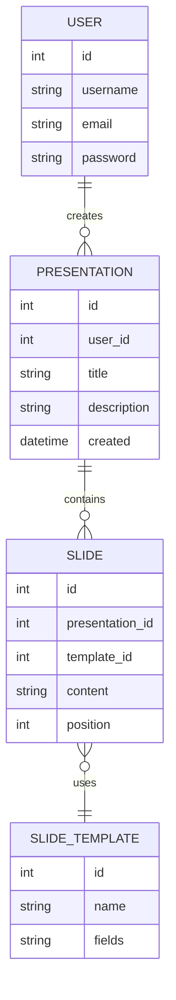

# Progetto_Maturita
# 🎞️ Slides App

Applicazione web sviluppata con Flask per la creazione e gestione di presentazioni, ispirata a strumenti come PowerPoint e Google Slides, ma semplificata tramite l’utilizzo di layout predefiniti.

---

## 🚀 Panoramica del progetto

Slides App è un’applicazione web che permette di:

* Creare presentazioni
* Aggiungere slide con strutture predefinite
* Organizzare contenuti in modo semplice e coerente
* Gestire tutto lato server, senza utilizzo di JavaScript

L’obiettivo principale è semplificare la creazione di slide attraverso **template fissi**, migliorando usabilità e consistenza.

---

## 🧠 Funzionalità principali

* 📂 Creazione e gestione delle presentazioni
* 🧾 Aggiunta di slide
* 🎨 Template predefiniti (es. titolo + testo, titolo + immagine)
* 💾 Salvataggio dati tramite database SQLite
* ⚙️ Rendering lato server con Flask e Jinja2
* ❌ Nessun utilizzo di JavaScript

---

## 🏗️ Struttura del progetto

```bash
slides-app/
├── run.py
├── setup_db.py
├── requirements.txt
│
├── app/
│   ├── __init__.py
│   ├── db.py
│   ├── auth.py
│   ├── main.py
│   ├── blueprints/
│   │   ├── presentations.py
│   │   ├── slides.py
│   │   └── templates.py
│   ├── repositories/
│   │   ├── presentation_repository.py
│   │   ├── slide_repository.py
│   │   └── template_repository.py
│   ├── templates/
│   │   ├── base.html
│   │   ├── presentations/
│   │   └── slides/
│   └── schema.sql
│
└── instance/
    └── slides.sqlite
```

---

## 🧪 Tecnologie utilizzate

* Python
* Flask
* SQLite
* HTML + CSS (inline)
* Jinja2

---

## ⚙️ Installazione e avvio

1. Clonare il repository:

```bash
git clone https://github.com/tuo-username/slides-app.git
cd slides-app
```

2. Creare un ambiente virtuale:

```bash
python -m venv venv
source venv/bin/activate   # Windows: venv\Scripts\activate
```

3. Installare le dipendenze:

```bash
pip install flask
```

4. Inizializzare il database:

```bash
python setup_db.py
```

5. Avviare l'applicazione:

```bash
python run.py
```

---

## 📊 Struttura del database (ER Diagram)



---

## 🧠 Scelte progettuali

* **Rendering lato server**: nessun utilizzo di JavaScript per mantenere l’app semplice e chiara
* **Template predefiniti**: migliorano l’usabilità e guidano l’utente nella creazione delle slide
* **SQLite**: database leggero e facile da integrare
* **Architettura modulare**: utilizzo di blueprint e repository per separare la logica

---

## 🎯 Obiettivo del progetto

Questo progetto è stato sviluppato come elaborato di fine anno con l’obiettivo di dimostrare:

* Sviluppo backend con Flask
* Progettazione e gestione di database relazionali
* Implementazione di operazioni CRUD
* Strutturazione pulita del codice
* Utilizzo di template dinamici

---

## 📈 Possibili sviluppi futuri

* Modifica ed eliminazione delle slide
* Supporto a più template
* Upload di immagini
* Esportazione in PDF
* Miglioramento dell’interfaccia utente

---

## 👨‍💻 Autore

Progetto sviluppato da [Tuo Nome]
