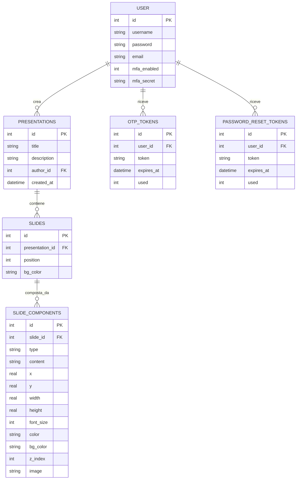

# 🎞️ SlidesApp

> Progetto di fine anno — Modulo 03: Sviluppo Web e Database
> Autore: **Cristian Monticelli** | Classe 5M | A.S. 2025/2026

SlidesApp è un'applicazione web per la creazione e la gestione di presentazioni digitali, sviluppata con Python e Flask. Permette di comporre ogni slide tramite un editor canvas visuale con componenti liberamente posizionabili (titolo, testo, immagine, link), esportare presentazioni in PowerPoint e importare file `.pptx` esistenti.

---

## 📋 Indice

1. [Funzionalità](#funzionalità)
2. [Stack tecnologico](#stack-tecnologico)
3. [Architettura del progetto](#architettura-del-progetto)
4. [Schema del database](#schema-del-database)
5. [Installazione e avvio](#installazione-e-avvio)
6. [Configurazione email](#configurazione-email)
7. [Scelte progettuali](#scelte-progettuali)
8. [Sviluppi futuri](#sviluppi-futuri)

---

## Funzionalità

### Gestione account
- Registrazione con username, email e password hashata (Werkzeug)
- Login e logout con sessioni Flask
- **Recupero password** via link monouso inviato all'indirizzo email registrato

### Presentazioni e slide
- Creazione, visualizzazione ed eliminazione di presentazioni personali
- Pagina pubblica nella home: tutte le presentazioni di tutti gli utenti visibili senza login
- Aggiunta di slide con tre template predefiniti: **Vuota**, **Titolo + Testo**, **Titolo + Testo + Immagine**
- Riordinamento slide con i pulsanti Sposta su / Sposta giù
- Modalità presentazione a schermo intero (slideshow)

### Editor canvas visuale
- Canvas fisso 960×540 px, scalato via CSS transform in base alla finestra
- Aggiunta di componenti: **Titolo**, **Testo**, **Immagine**, **Link**
- **Drag & drop** per spostare i componenti con il mouse
- **Ridimensionamento** tramite 8 handle direzionali (nw, n, ne, e, se, s, sw, w)
- **Pannello proprietà** laterale: modifica testo, dimensione font, colore, sfondo
- Spostamento fine con i tasti freccia (1%; con Shift 5%)
- Eliminazione componente con tasto Canc o dal pannello
- Salvataggio tramite chiamata AJAX senza ricaricare la pagina

### Import / Export PowerPoint
- **Esportazione** della presentazione in formato `.pptx` scaricabile
- **Importazione** di file `.pptx`: ogni slide del file viene convertita in slide con componenti (testi, immagini)

### Internazionalizzazione
- Interfaccia disponibile in **italiano**, **inglese** e **spagnolo**
- Selettore a bandiera sempre visibile nella topbar (click, non solo hover)
- La lingua scelta persiste tra le pagine e attraverso login/logout

---

## Stack tecnologico

| Layer | Tecnologia |
|---|---|
| Backend | Python 3, Flask |
| Database | SQLite (via modulo `sqlite3`) |
| Autenticazione | Werkzeug (hashing), Flask sessions |
| MFA | pyotp (TOTP), qrcode (QR PNG) |
| Email | Flask-Mail (Gmail SMTP) |
| Internazionalizzazione | Flask-Babel (GNU gettext) |
| Import/Export pptx | python-pptx |
| Frontend | HTML, CSS, Jinja2, JavaScript (AJAX con `fetch()`) |
| Variabili d'ambiente | python-dotenv |

---

## Architettura del progetto

Il codice è organizzato seguendo il **pattern Blueprint + Repository**, che separa le responsabilità in moduli indipendenti.

```
slides-app/
├── run.py
├── setup_db.py
├── requirements.txt
├── .env.example
├── babel.cfg
│
└── app/
    ├── __init__.py
    ├── auth.py
    ├── db.py
    ├── main.py
    ├── schema.sql
    │
    ├── blueprints/
    │   ├── presentations.py
    │   ├── slides.py
    │   └── api.py
    │
    ├── repositories/
    │   ├── user_repository.py
    │   ├── presentation_repository.py
    │   ├── slide_repository.py
    │   └── slide_component_repository.py
    │
    ├── templates/
    │   ├── base.html
    │   ├── main/index.html
    │   ├── auth/
    │   ├── presentations/
    │   └── slides/
    │
    ├── static/uploads/
    └── translations/
```

### Blueprint e responsabilità

| Blueprint | Prefisso | Responsabilità |
|---|---|---|
| `main` | `/` | Home pubblica con tutte le presentazioni |
| `presentations` | `/presentations` | CRUD presentazioni, dettaglio, slideshow |
| `slides` | `/slides` | Editor canvas visuale |
| `api` | `/api` | Endpoint JSON per AJAX, export/import pptx |
| `auth` | `/auth` | Login, register, logout, MFA, reset password |

---

## Schema del database



La tabella `SLIDE_COMPONENTS` è il cuore del sistema: ogni componente ha posizione e dimensione in percentuale (0–100%) rispetto a un canvas 960×540, permettendo il ridimensionamento responsive senza perdere le proporzioni.

---

## Installazione e avvio

### Prerequisiti
- Python 3.10 o superiore
- pip

### Passi

```bash
# 1. Clona il repository
git clone https://github.com/CristianMonticelli/Progetto_Maturita.git
cd Progetto_Maturita/slides-app

# 2. Crea e attiva l'ambiente virtuale
python -m venv venv
source venv/bin/activate        # Windows: venv\Scripts\activate

# 3. Installa le dipendenze
pip install -r requirements.txt

# 4. Crea il file delle credenziali
cp .env.example .env
# Apri .env e inserisci le tue credenziali

# 5. Inizializza il database
python setup_db.py

# 6. Compila le traduzioni
pybabel compile -d app/translations

# 7. (Opzionale) Crea account demo con contenuto di esempio
python seed_demo.py
# Username: demo | Password: demo1234

# 8. Avvia l'applicazione
python run.py
```

L'app sarà disponibile su `http://127.0.0.1:5000`.

---

## Configurazione email

Il recupero password e l'MFA via email richiedono credenziali Gmail.

```bash
cp .env.example .env
```

Apri `.env` e compila:

```
MAIL_USERNAME=tua-email@gmail.com
MAIL_PASSWORD=xxxx-xxxx-xxxx-xxxx
SECRET_KEY=una-stringa-casuale-lunga
```

`MAIL_PASSWORD` deve essere una **App Password Gmail**, non la password dell'account:

1. Vai su [Account Google](https://myaccount.google.com) → **Sicurezza**
2. Abilita **Verifica in 2 passaggi**
3. Torna su **Sicurezza** → **Password per le app**
4. Genera una password per "Posta" e incollala nel `.env`

Senza `.env` configurato l'app funziona normalmente; solo l'invio email non è attivo.

---

## Scelte progettuali

### Pattern Blueprint + Repository
Il codice è separato in moduli che gestiscono singole responsabilità. I Blueprint raggruppano le route per area funzionale; i Repository incapsulano tutto l'accesso al database, così cambiare il DBMS non richiede di toccare i controller.

### AJAX con `fetch()` e API JSON
Tutte le operazioni CRUD (crea presentazione, aggiungi slide, sposta, elimina) usano chiamate AJAX verso endpoint `/api/...` che rispondono in JSON. La pagina non si ricarica: il DOM viene aggiornato direttamente in JavaScript. Questo approccio è stato introdotto selettivamente solo dove migliora l'esperienza utente, mantenendo il rendering iniziale lato server con Jinja2.

### Editor canvas in percentuale
Le posizioni e dimensioni dei componenti sono memorizzate come percentuali (0–100) rispetto a un canvas virtuale 960×540. Il canvas reale viene scalato via `CSS transform: scale()` in base alla finestra disponibile. Questa scelta permette di visualizzare le slide in modo identico nell'editor, nella preview e nel presenter su qualsiasi schermo.

### MFA con doppio metodo
L'autenticazione a due fattori supporta sia TOTP (standard RFC 6238, compatibile con Google Authenticator) che OTP via email. Il TOTP non richiede connessione internet lato client: il codice è generato localmente dall'app authenticator usando un segreto condiviso una sola volta via QR code.

### Internazionalizzazione GNU gettext
Le stringhe dell'interfaccia sono avvolte con `_()` di Flask-Babel. I file `.po` (leggibili) vengono compilati in `.mo` (binari) che Flask-Babel legge a runtime. La lingua è salvata in `session['lang']` e viene preservata esplicitamente durante `session.clear()` al login e logout.

### Punto di ingresso unico per la creazione

La creazione di una nuova presentazione avviene esclusivamente tramite il pulsante "Crea presentazione" nella barra di navigazione in alto, sempre visibile. In una versione precedente esisteva un secondo bottone con modal AJAX nella pagina delle presentazioni personali — è stato rimosso per semplificare l'interfaccia ed evitare duplicazioni.

---

## Sviluppi futuri

- Condivisione di presentazioni con altri utenti tramite link
- Modalità collaborativa in tempo reale (WebSocket)
- Esportazione in PDF
- Più template predefiniti per le slide
- Supporto a forme geometriche come componente aggiuntivo
- Autenticazione a due fattori (MFA): via app TOTP con QR code (Google Authenticator) oppure via codice OTP via email. Lo schema del database è già predisposto con le colonne `mfa_enabled` e `mfa_secret` nella tabella utenti.

---

## Crediti e ispirazioni

### Logica drag & drop
L'algoritmo di drag & drop nell'editor canvas (ora in `app/static/js/edit-slide.js`) si basa sul pattern classico descritto nel tutorial [javascript.info — Mouse drag & drop](https://javascript.info/mouse-drag-drop): registrazione dell'offset al click sul componente (`dragOffPct`), aggiornamento continuo della posizione in `mousemove` con coordinate in percentuale rispetto al canvas, rilascio dello stato in `mouseup`. Il codice è stato adattato per lavorare con un canvas scalato tramite `CSS transform: scale()` e per supportare otto handle di ridimensionamento direzionali (nw, n, ne, e, se, s, sw, w).

### Gestione interazioni UI
L'approccio alla gestione degli eventi di trascinamento e ridimensionamento è ispirato ai pattern di librerie come [interact.js](https://interactjs.io/), pur non essendo usata direttamente nel progetto. Tutta la logica è implementata in JavaScript vanilla senza dipendenze esterne.

### Note sul flusso di navigazione

La creazione di una nuova presentazione avviene tramite il pulsante "Crea presentazione" nella barra di navigazione in alto, sempre visibile. In una versione precedente esisteva un secondo pulsante con modal AJAX nella pagina delle presentazioni personali — è stato rimosso per semplificare l'interfaccia ed evitare duplicazioni.

---

## Fonti e riferimenti

Il progetto include funzionalità che non sono state affrontate a scuola. Il codice è stato adattato dalle seguenti risorse esterne:

### Editor canvas: drag & drop

- **Algoritmo drag & drop** (mousedown / mousemove / mouseup con offset):
  https://javascript.info/mouse-drag-and-drop

- **Posizione relativa al canvas** (getBoundingClientRect):
  https://developer.mozilla.org/en-US/docs/Web/API/Element/getBoundingClientRect

### Editor canvas: resize con handle direzionali

- **Concetto degli 8 handle di resize** (nw, n, ne, e, se, s, sw, w):
  https://github.com/taye/interact.js

### Chiamate AJAX

- **Chiamate AJAX con fetch**:
  https://javascript.info/fetch

### Modalità presentazione fullscreen

- **API fullscreen del browser**:
  https://developer.mozilla.org/en-US/docs/Web/API/Fullscreen_API

### Import/Export PowerPoint

- **Creazione file .pptx — python-pptx quickstart**:
  https://python-pptx.readthedocs.io/en/latest/user/quickstart.html
  Fonte principale per export: aggiunta slide, caselle di testo (add_textbox), immagini (add_picture), colore sfondo e RGBColor.

- **Unità di misura EMU in python-pptx**:
  https://python-pptx.readthedocs.io/en/latest/user/units.html
  Usato per convertire le posizioni percentuali del canvas nelle coordinate EMU richieste da PowerPoint (9 144 000 × 5 143 500).

- **Lettura file .pptx — python-pptx shapes**:
  https://python-pptx.readthedocs.io/en/latest/user/shapes.html
  Usato per iterare forme, riconoscere testi (has_text_frame), immagini (MSO_SHAPE_TYPE.PICTURE) e leggerne font e colori.

- **Repository ufficiale python-pptx con esempi**:
  https://github.com/scanny/python-pptx
  Consultato per il pattern BytesIO + send_file (generazione del file in memoria senza salvarlo su disco prima di inviarlo al browser).

### Validazione email lato server

- **Regex validazione email — RFC 5322 semplificato**:
  https://emailregex.com
  Usato come riferimento per costruire l'espressione regolare che
  verifica il formato dell'indirizzo email durante la registrazione
  (`r'^[a-zA-Z0-9._%+\-]+@[a-zA-Z0-9.\-]+\.[a-zA-Z]{2,}$'`).
