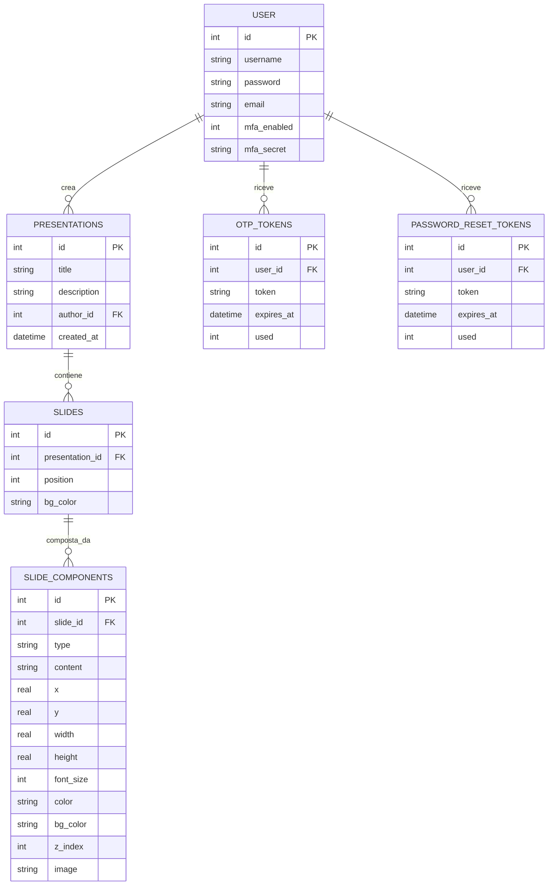

# 🎞️ SlidesApp

> Progetto di fine anno — Modulo 03: Sviluppo Web e Database
> Autore: **Cristian Monticelli** | Classe 5M | A.S. 2025/2026

SlidesApp è un'applicazione web per la creazione e la gestione di presentazioni digitali, sviluppata con Python e Flask. Permette di comporre ogni slide tramite un editor canvas visuale con componenti liberamente posizionabili (titolo, testo, immagine, link), esportare presentazioni in PowerPoint e importare file `.pptx` esistenti.

---

## 📋 Indice

1. [Funzionalità](#funzionalità)
2. [Stack tecnologico](#stack-tecnologico)
3. [Architettura del progetto](#architettura-del-progetto)
4. [Schema del database](#schema-del-database)
5. [Installazione e avvio](#installazione-e-avvio)
6. [Configurazione email](#configurazione-email)
7. [Scelte progettuali](#scelte-progettuali)
8. [Sviluppi futuri](#sviluppi-futuri)

---

## Funzionalità

### Gestione account
- Registrazione con username, email e password hashata (Werkzeug)
- Login e logout con sessioni Flask
- **Autenticazione a due fattori (MFA)**: via app TOTP (Google Authenticator, Authy) con QR code, oppure via codice OTP inviato per email
- **Recupero password** via link monouso inviato all'indirizzo email registrato

### Presentazioni e slide
- Creazione, visualizzazione ed eliminazione di presentazioni personali
- Pagina pubblica nella home: tutte le presentazioni di tutti gli utenti visibili senza login
- Aggiunta di slide con tre template predefiniti: **Vuota**, **Titolo + Testo**, **Titolo + Testo + Immagine**
- Riordinamento slide con i pulsanti Sposta su / Sposta giù
- Modalità presentazione a schermo intero (slideshow)

### Editor canvas visuale
- Canvas fisso 960×540 px, scalato via CSS transform in base alla finestra
- Aggiunta di componenti: **Titolo**, **Testo**, **Immagine**, **Link**
- **Drag & drop** per spostare i componenti con il mouse
- **Ridimensionamento** tramite 8 handle direzionali (nw, n, ne, e, se, s, sw, w)
- **Pannello proprietà** laterale: modifica testo, dimensione font, colore, sfondo
- Spostamento fine con i tasti freccia (1%; con Shift 5%)
- Eliminazione componente con tasto Canc o dal pannello
- Salvataggio tramite chiamata AJAX senza ricaricare la pagina

### Import / Export PowerPoint
- **Esportazione** della presentazione in formato `.pptx` scaricabile
- **Importazione** di file `.pptx`: ogni slide del file viene convertita in slide con componenti (testi, immagini)

### Internazionalizzazione
- Interfaccia disponibile in **italiano**, **inglese** e **spagnolo**
- Selettore a bandiera sempre visibile nella topbar (click, non solo hover)
- La lingua scelta persiste tra le pagine e attraverso login/logout

---

## Stack tecnologico

| Layer | Tecnologia |
|---|---|
| Backend | Python 3, Flask |
| Database | SQLite (via modulo `sqlite3`) |
| Autenticazione | Werkzeug (hashing), Flask sessions |
| MFA | pyotp (TOTP), qrcode (QR PNG) |
| Email | Flask-Mail (Gmail SMTP) |
| Internazionalizzazione | Flask-Babel (GNU gettext) |
| Import/Export pptx | python-pptx |
| Frontend | HTML, CSS, Jinja2, JavaScript (AJAX con `fetch()`) |
| Variabili d'ambiente | python-dotenv |

---

## Architettura del progetto

Il codice è organizzato seguendo il **pattern Blueprint + Repository**, che separa le responsabilità in moduli indipendenti.

```
slides-app/
├── run.py
├── setup_db.py
├── requirements.txt
├── .env.example
├── babel.cfg
│
└── app/
    ├── __init__.py
    ├── auth.py
    ├── db.py
    ├── main.py
    ├── schema.sql
    │
    ├── blueprints/
    │   ├── presentations.py
    │   ├── slides.py
    │   └── api.py
    │
    ├── repositories/
    │   ├── user_repository.py
    │   ├── presentation_repository.py
    │   ├── slide_repository.py
    │   └── slide_component_repository.py
    │
    ├── templates/
    │   ├── base.html
    │   ├── main/index.html
    │   ├── auth/
    │   ├── presentations/
    │   └── slides/
    │
    ├── static/uploads/
    └── translations/
```

### Blueprint e responsabilità

| Blueprint | Prefisso | Responsabilità |
|---|---|---|
| `main` | `/` | Home pubblica con tutte le presentazioni |
| `presentations` | `/presentations` | CRUD presentazioni, dettaglio, slideshow |
| `slides` | `/slides` | Editor canvas visuale |
| `api` | `/api` | Endpoint JSON per AJAX, export/import pptx |
| `auth` | `/auth` | Login, register, logout, MFA, reset password |

---

## Schema del database



La tabella `SLIDE_COMPONENTS` è il cuore del sistema: ogni componente ha posizione e dimensione in percentuale (0–100%) rispetto a un canvas 960×540, permettendo il ridimensionamento responsive senza perdere le proporzioni.

---

## Installazione e avvio

### Prerequisiti
- Python 3.10 o superiore
- pip

### Passi

```bash
# 1. Clona il repository
git clone https://github.com/CristianMonticelli/Progetto_Maturita.git
cd Progetto_Maturita/slides-app

# 2. Crea e attiva l'ambiente virtuale
python -m venv venv
source venv/bin/activate        # Windows: venv\Scripts\activate

# 3. Installa le dipendenze
pip install -r requirements.txt

# 4. Crea il file delle credenziali
cp .env.example .env
# Apri .env e inserisci le tue credenziali

# 5. Inizializza il database
python setup_db.py

# 6. Compila le traduzioni
pybabel compile -d app/translations

# 7. Avvia l'applicazione
python run.py
```

L'app sarà disponibile su `http://127.0.0.1:5000`.

---

## Configurazione email

Il recupero password e l'MFA via email richiedono credenziali Gmail.

```bash
cp .env.example .env
```

Apri `.env` e compila:

```
MAIL_USERNAME=tua-email@gmail.com
MAIL_PASSWORD=xxxx-xxxx-xxxx-xxxx
SECRET_KEY=una-stringa-casuale-lunga
```

`MAIL_PASSWORD` deve essere una **App Password Gmail**, non la password dell'account:

1. Vai su [Account Google](https://myaccount.google.com) → **Sicurezza**
2. Abilita **Verifica in 2 passaggi**
3. Torna su **Sicurezza** → **Password per le app**
4. Genera una password per "Posta" e incollala nel `.env`

Senza `.env` configurato l'app funziona normalmente; solo l'invio email non è attivo.

---

## Scelte progettuali

### Pattern Blueprint + Repository
Il codice è separato in moduli che gestiscono singole responsabilità. I Blueprint raggruppano le route per area funzionale; i Repository incapsulano tutto l'accesso al database, così cambiare il DBMS non richiede di toccare i controller.

### AJAX con `fetch()` e API JSON
Tutte le operazioni CRUD (crea presentazione, aggiungi slide, sposta, elimina) usano chiamate AJAX verso endpoint `/api/...` che rispondono in JSON. La pagina non si ricarica: il DOM viene aggiornato direttamente in JavaScript. Questo approccio è stato introdotto selettivamente solo dove migliora l'esperienza utente, mantenendo il rendering iniziale lato server con Jinja2.

### Editor canvas in percentuale
Le posizioni e dimensioni dei componenti sono memorizzate come percentuali (0–100) rispetto a un canvas virtuale 960×540. Il canvas reale viene scalato via `CSS transform: scale()` in base alla finestra disponibile. Questa scelta permette di visualizzare le slide in modo identico nell'editor, nella preview e nel presenter su qualsiasi schermo.

### MFA con doppio metodo
L'autenticazione a due fattori supporta sia TOTP (standard RFC 6238, compatibile con Google Authenticator) che OTP via email. Il TOTP non richiede connessione internet lato client: il codice è generato localmente dall'app authenticator usando un segreto condiviso una sola volta via QR code.

### Internazionalizzazione GNU gettext
Le stringhe dell'interfaccia sono avvolte con `_()` di Flask-Babel. I file `.po` (leggibili) vengono compilati in `.mo` (binari) che Flask-Babel legge a runtime. La lingua è salvata in `session['lang']` e viene preservata esplicitamente durante `session.clear()` al login e logout.

---

## Sviluppi futuri

- Condivisione di presentazioni con altri utenti tramite link
- Modalità collaborativa in tempo reale (WebSocket)
- Esportazione in PDF
- Più template predefiniti per le slide
- Supporto a forme geometriche come componente aggiuntivo
