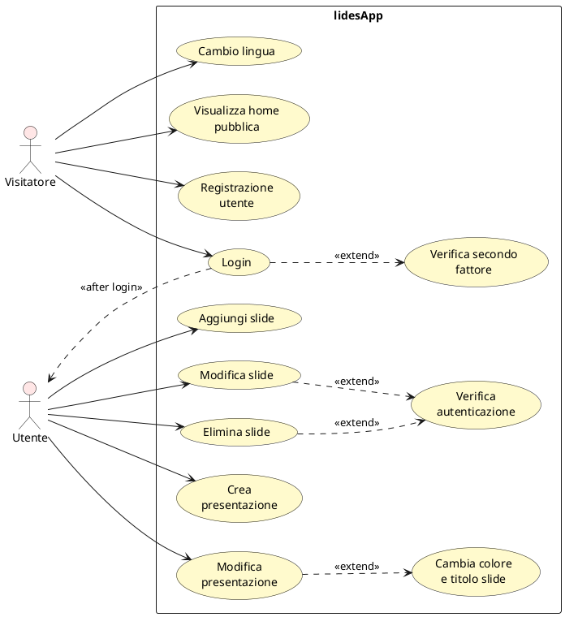

# Casi d'Uso - lidesApp

## Diagramma dei Casi d'Uso

## Legenda
- **→** Associazione (l'attore utilizza il caso d'uso)
- **..>** Estensione (relazione include/extend)

## Descrizione Casi d'Uso

### Visitatore
| Caso d'Uso | Descrizione |
|-----------|-------------|
| Visualizza home pubblica | Accesso alla pagina principale |
| Registrazione utente | Creazione nuovo account |
| Login | Accesso con credenziali |
| Cambio lingua | Personalizzazione lingua |
| Verifica secondo fattore | Autenticazione 2FA |

### Utente
| Caso d'Uso | Descrizione |
|-----------|-------------|
| Crea presentazione | Creazione nuova presentazione |
| Modifica presentazione | Modifica proprietà |
| Aggiungi slide | Aggiunta slide |
| Modifica slide | Modifica contenuto slide |
| Elimina slide | Rimozione slide |
| Cambia colore e titolo slide | Personalizzazione slide |
| Verifica autenticazione | Verifica accesso |