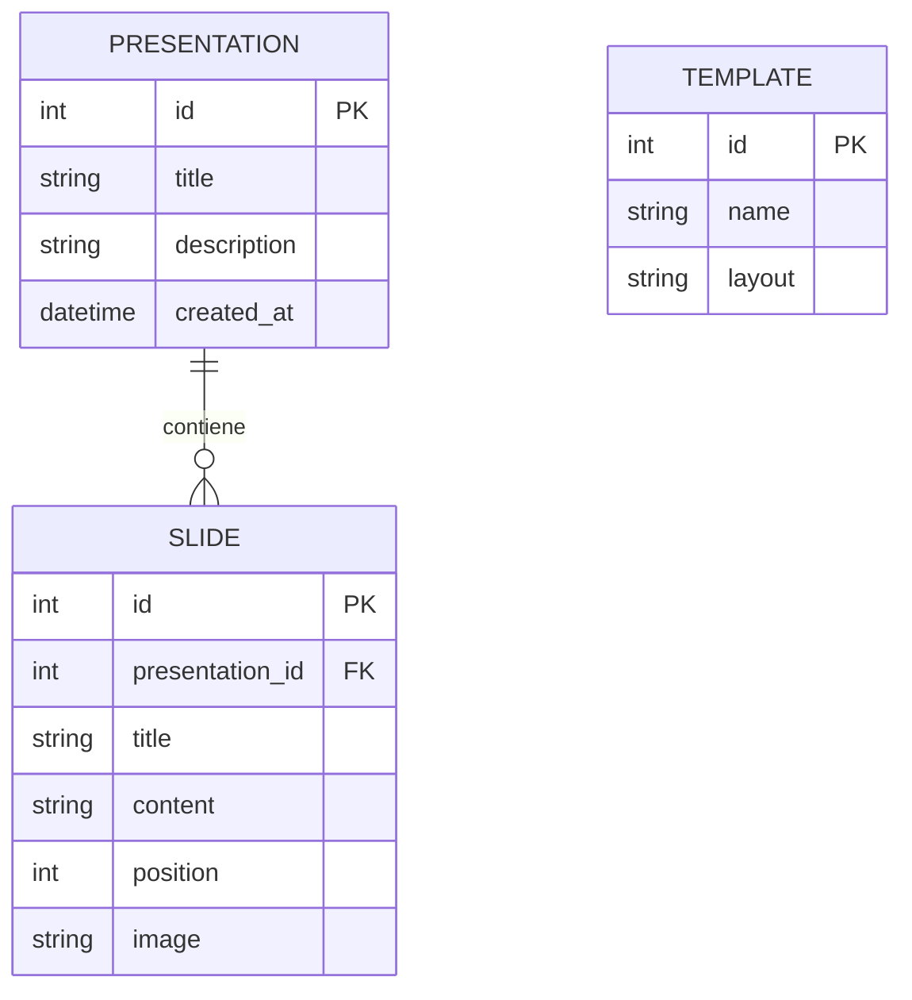
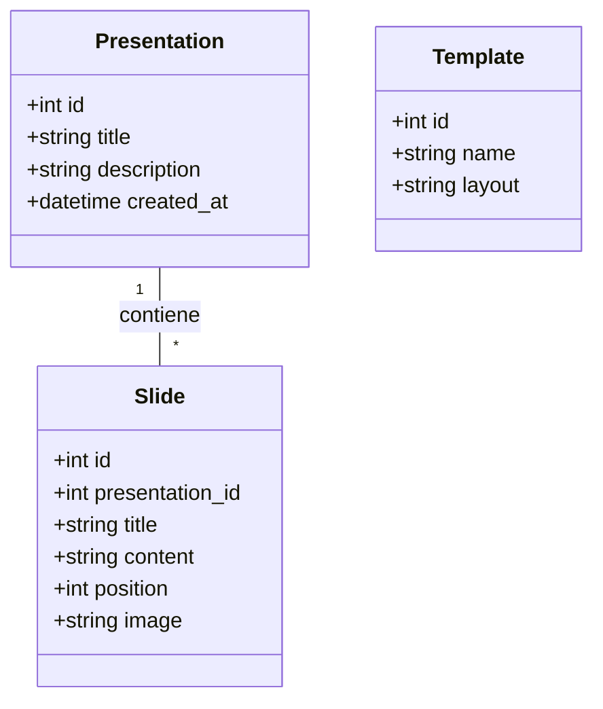
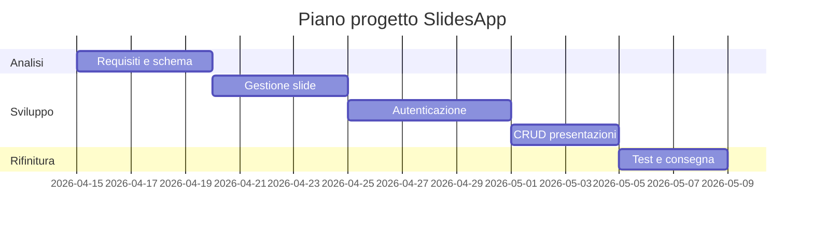

# Documento dei Requisiti - SlidesApp

> Questo documento descrive i requisiti per il progetto SlidesApp, un'applicazione web per creare e gestire presentazioni digitali.

## 1. Introduzione

### 1.1 Scopo del documento

Lo scopo di questo documento è:
- descrivere in modo chiaro il prodotto SlidesApp;
- raccogliere i requisiti funzionali e non funzionali;
- fornire una progettazione concettuale con diagrammi ER, UML e casi d'uso;
- definire una roadmap di lavoro.

### 1.2 Contesto

SlidesApp è un'applicazione web sviluppata con Flask e database SQLite, che permette agli utenti di creare presentazioni composte da slide.

### 1.3 Tema

SlidesApp: un'applicazione per creare presentazioni digitali con slide personalizzabili.

## 2. Obiettivi generali

- Permettere agli utenti di registrarsi e autenticarsi.
- Consentire la creazione, modifica ed eliminazione di presentazioni.
- Gestire slide all'interno delle presentazioni (aggiunta, modifica, ordinamento).
- Fornire template per le slide.
- Visualizzare le presentazioni.

## 3. Stakeholder e attori

| Stakeholder | Ruolo | Interesse |
| --- | --- | --- |
| Studente | Sviluppatore | Realizzare il progetto |
| Docente | Valutatore | Verificare il progetto |
| Utente finale | Utente | Creare presentazioni |

### Attori principali

- `Utente autenticato`
- `Visitatore`

## 4. Requisiti funzionali

### 4.1 Requisiti principali

1. Registrazione e login.
2. Creazione di presentazioni con titolo e descrizione.
3. Aggiunta, modifica, eliminazione di slide in una presentazione.
4. Ordinamento delle slide.
5. Upload di immagini per le slide.
6. Visualizzazione delle presentazioni.

### 4.2 User stories

- Come utente, voglio registrarmi per salvare le mie presentazioni.
- Come utente autenticato, voglio creare una presentazione.
- Come utente, voglio aggiungere slide alla mia presentazione.

## 5. Requisiti non funzionali

- Interfaccia semplice.
- Password hashate.
- Database SQLite.
- Codice organizzato con Blueprints e repository.
- Ambiente virtuale Python.

## 6. Glossario dei termini

- `Presentazione`: insieme di slide.
- `Slide`: elemento singolo con titolo, contenuto, immagine.
- `Template`: layout predefinito per slide.

## 7. Entità e relazioni (schema ER)

## 8. Diagramma UML delle classi

## 9. Casi d'uso

### 9.1 Casi d'uso principali

1. Registrazione utente
2. Login
3. Crea presentazione
4. Aggiungi slide
5. Visualizza presentazione

### 9.2 Descrizione semplificata

- **Crea presentazione**: utente compila form per titolo e descrizione.
- **Aggiungi slide**: utente aggiunge slide con contenuto.

## 10. Pianificazione e milestone

| Settimana | Attività |
| --- | --- |
| 1 | Analisi requisiti, schema ER/UML |
| 2 | Gestione slide |
| 3 | Autenticazione |
| 4 | CRUD presentazioni |
| 5 | Testing e documentazione |

## 11. Suggerimenti per la consegna

- Struttura chiara su GitHub.
- README con istruzioni.
- .gitignore per escludere instance/, __pycache__.